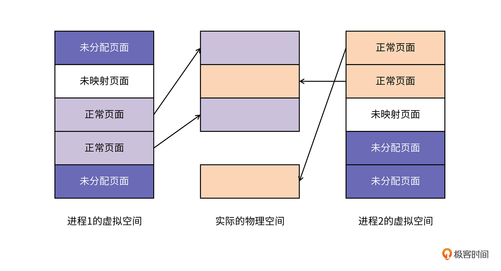
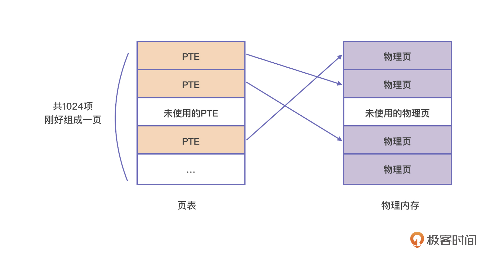
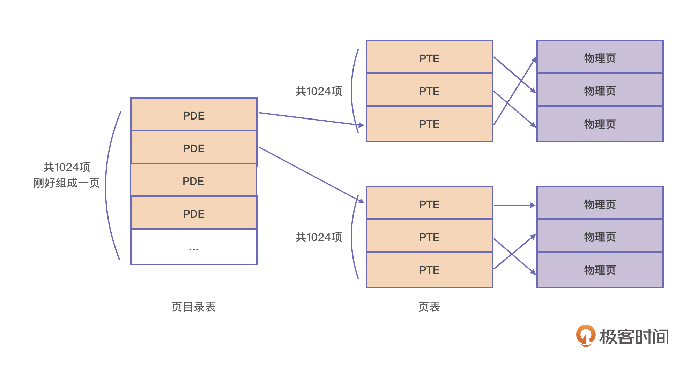
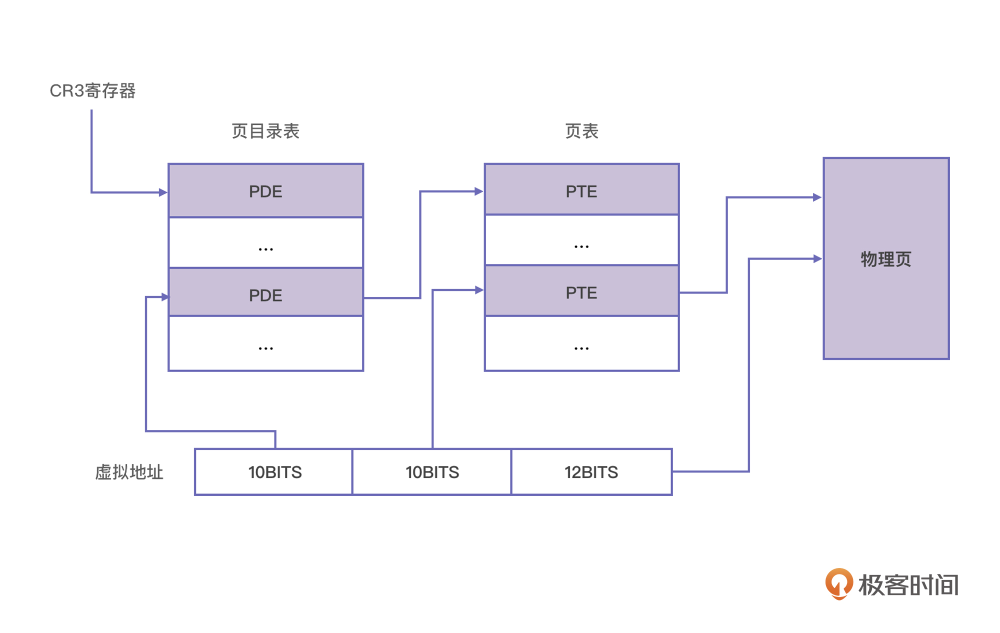

# 01｜虚拟内存：为什么可用内存会远超物理内存？

<video src="./01｜虚拟内存：为什么可用内存会远超物理内存？.mp4">
  你的浏览器不支持 audio 标签。
</video>


你好，我是海纳。

今天是我们的第1节课，我想用一个比较有趣的、很多人都遇到过的问题作为我们这门课的开场，带你正式迈入计算机内存的学习课堂。

我不知道在你刚接触计算机的时候，有没有这么一个疑问：“为什么我的机器上只有两个G的物理内存，但我却可以使用比这大得多的内存，比如256T？”

反正我当时还是挺疑惑的，不过现在我可以来告诉你这个答案了。这个问题背后的机制是十分复杂的，但它的核心是计算机中物理内存和虚拟内存的关系，尤其是虚拟内存的运行原理。只要你搞懂了它们，这个问题也就迎刃而解了。

不止如此，虚拟内存的运行原理还是打开计算机底层知识大门的钥匙，只有掌握好它，我们才能继续学习更多的底层原理。我们整个课程的目的，就是让你在遇到进程崩溃、内存访问错误、SIGSEGV、double free、内存泄漏等与内存相关的错误时，可以有的放矢，把握分析问题的方向。而今天的第一课就是把打开这扇门的钥匙交到你手上。

在回答虚拟内存的相关问题之前，我们需要先看看物理内存的含义。

## 物理内存

计算机的物理内存，简单说就是那根内存条，你的内存条是1G的，那计算机可用的物理内存就是1G。这个内存条加电以后就可以存储数据了，CPU运算的数据都是存储在主存里的。

计算机的主存是由多个连续的单元组成的，每个单元称为一个字节，每个字节都有一个唯一的物理地址(Physical Address， PA)，地址编码是从0开始的。所以，如果计算机上配有2G的内存，那么，这个计算机可用的物理内存空间就是0到2G。

在早期的CPU指令集里，从内存中加载数据，向内存中写入数据都是直接操作物理内存的。也就是说每一个数据存储在内存的什么位置，都由程序员自己负责。例如，8086这款40年前的CPU的mov指令就可以直接访问物理内存。至今，X86架构的CPU在上电以后，为了与8086保持兼容，还是运行在16位实模式下，实模式的特点是所有访存指令访问的都是物理内存地址。你可以先看看这条代码：

```
movb ($0x10), %ax

```

这条汇编代码的作用，就是将物理地址为0x10的那个字节里的内容送入到ax寄存器。（实际上，这里默认使用了数据段寄存器，但并不影响我们理解物理地址（内存）的概念。关于段寄存器，我们下节课会讲解）。不过这里你要注意，上面这句代码是AT&T风格的汇编代码，与Intel风格的汇编不同，其目标操作数和源操作数的位置是相反的。

但是直接访问物理内存，存在着一个很大的问题。

因为这种模式下，必然要求程序员手动对数据进行布局，那么内存不够用怎么办呢？而且，每个进程分配多少内存、如何保证指令中访存地址的正确性，这些问题都全部要程序员来负责。

这是难以忍受的。随着我们后面的讲解，你会发现，如果上面这些工作都全部交由开发者手动来做的话，就相当于每一个开发者要把linker和loader的事情从头做一遍，效率会非常低。

那既然直接访问物理内存效率那么低，现在还有开发人员用这种模式吗？

其实也还是有的。在嵌入式设备中，手动管理内存的操作还是广泛存在的。这是因为在嵌入式开发中，往往没有进程的概念，也就是说整个应用独享全部内存，所以手动管理内存才有可能性。在单进程的系统中，所有的物理资源都是单一进程在管理，直接管理物理内存的操作复杂度还可以接受。尽管如此，嵌入式开发中手动管理内存仍然是一项对程序员要求极高的工作。

不过，对于我们普通软件工程师来说，系统中经常有多个进程，多进程之间的协同分配内存和释放内存就没那么容易了，这个时候我们要怎么办呢？

幸好，局部性原理成了我们的救命稻草。基于局部性原理，CPU为程序员虚拟化了一层内存，我们只需要与虚拟内存打交道就可以了。所以接下来，我们就来讨论局部性原理说的是什么，聪明的CPU设计人员又是如何将这个原理完美应用的。

## 局部性原理

在绝大多数程序的运行过程中，当前指令大概率都会引用最近访问过的数据。也就是说，程序的数据访问会表现出明显的倾向性。这种倾向性，我们就称之为局部性原理(Principle of locality)。

我们可以从两个方面来理解局部性原理。第一个方面是时间局部性，也就是说被访问过一次的内存位置很可能在不远的将来会被再次访问；另一方面是空间局部性，说的是如果一个内存位置被引用过，那么它邻近的位置在不远的将来也有很大概率会被访问。

基于这个原理，我们可以做出一个合理的推论： **无论一个进程占用的内存资源有多大，在任一时刻，它需要的物理内存都是很少的**。在这个推论的基础上，CPU为每个进程只需要保留很少的物理内存就可以保证进程的正常执行了。

而且，为了让程序员编程方便，CPU和操作系统还联手编织了一个假象： **每个进程都独享128T的虚拟内存空间，并且每个进程的地址空间都是相互隔离的**。什么意思呢？比如说，现在进程A中有个变量a，它的地址是0x100，但是进程B中也有个变量b，它的地址也是0x100。但这并不会造成冲突，因为进程A的地址空间与进程B的地址空间是独立的，相互不影响。

这就极大地解放了程序员的生产力。我们可以对比一下直接操作物理内存和操作虚拟内存，程序员要关心的事情都有哪些。

在直接操作物理内存的情况下，你需要知道每一个变量的位置都安排在了哪里，而且还要注意和当前这个进程同时工作的进程，不能共用同一个地址，否则就会造成地址冲突。你想，一个项目中会有成百万的变量和函数，我们都要给它计算一个合理的位置，还不能与其他进程冲突，这是根本不可能完成的任务。

而直接操作虚拟内存的情况就变得简单多了。你可以独占128T内存，任意地使用，系统上还运行了哪些进程已经与我们完全没有关系了。为变量和函数分配地址的活，我们交给链接器去自动安排就可以了。这一切都是因为虚拟内存能够提供内存地址空间的隔离，极大地扩展了可用空间。

这是什么意思呢？就是说虚拟内存不仅让每个进程都有独立的、私有的内存空间，而且这个地址空间比可用的物理内存要大得多。不过，任何一个虚拟内存里所存储的数据，还是保存在真实的物理内存里的。换句话说， **任何虚拟内存最终都要映射到物理内存，但虚拟内存的大小又远超真实的物理内存的大小**。

那虚拟内存具体是怎么做到的呢？

## 虚拟内存与程序局部性原理

答案很简单，就是CPU充分利用程序局部性原理，提出了虚拟内存和物理内存的映射(Mapping)机制。这也是我们开头那个问题的答案，更具体的原理，我们接着往下看。

操作系统管理着这种映射关系，所以你在写代码的时候，就不用再操心物理内存的使用情况了，你看到的内存就是虚拟内存。

这种映射关系是以页为单位的。你看看下面这张图就很好理解了，多个进程的虚拟内存中的页都被映射到物理内存页上。



我希望你可以从图中看到这两点。第一，虽然虚拟内存提供了很大的空间，但实际上进程启动之后，这些空间并不是全部都能使用的。开发者必须要使用malloc等分配内存的接口才能将内存从待分配状态变成已分配状态。

在你得到一块虚拟内存以后，这块内存就是未映射状态，因为它并没有被映射到相应的物理内存，直到对该块内存进行读写时，操作系统才会真正地为它分配物理内存。然后这个页面才能成为正常页面。

第二，在虚拟内存中连续的页面，在物理内存中不必是连续的。只要维护好从虚拟内存页到物理内存页的映射关系，你就能正确地使用内存了。这种映射关系是操作系统通过页表来自动维护的，不必你操心。

不过你还要注意一点，计算机的虚拟内存大小是不一样的。虚拟地址空间往往与机器字宽有关系。例如32位机器上，指向内存的指针是32位的，所以它的虚拟地址空间是2的32次方，也就是4G。在64位机器上，指向内存的指针就是64位的，但在64位系统里只使用了低48位，所以它的虚拟地址空间是2的48次方，也就是256T。

### 页表的结构

不过，虽然大多数情况下，CPU和操作系统会一起完成页面的自动映射，不需要你关心其中的机制。但是当我们在做系统性能优化的时候，理解内存映射的过程就是十分必要的了。

例如，我就曾经遇到过一个性能很差的程序，经过perf工具分析后，我发现是因为缺页中断过多导致的。这个时候，那么掌握页的结构和映射过程的知识就非常有必要了。所以我也想跟你来探讨一下这方面的内容。

我们刚才也说了，映射的过程，是由CPU的内存管理单元(Memory Management Unit, MMU)自动完成的，但它依赖操作系统设置的页表。

页表的本质是页表项(Page Table Entry, PTE)的数组，虚拟空间中的每一个页在页表中都有一个PTE与之对应，PTE中会记录这个虚拟内存页所对应的实际物理页的起始地址。为方便理解，我这举了个例子，下面这张图描述的是i7处理器中的页面映射机制。



你可以看到，i7处理器的页表也是存储在内存页里的，每个页表项都是4字节。所以，人们就将1024个页表项组成一张页表。这样一张页表的大小就刚好是4K，占据一个内存页，这样就更加方便管理。而且，当前市场上主流的处理器也都选择将页大小定为4K。

一个页表项对应着一个大小为4K的页，所以1024个页表项所能支持的空间就是4M。那为了编码更多地址，我们必须使用更多的页表。而且，为了管理这些页表，我们还可以继续引入页表的数组： **页目录表**。

页目录表中的每一项叫做页目录项(Page Directory Entry, PDE)，每个PDE都对应一个页表，它记录了页表开始处的物理地址，这就是多级页表结构。现代的64位处理器上，为了编码更大的空间，还存在更多级的页表。



好了，我们现在已经搞清楚页面映射的机制原理了，那接下来，我们再用一个例子让你更具体地感受一下页面映射的过程。为了论述方便，我们以32位操作系统为例，看看CPU是如何通过一个虚拟地址找到物理内存中的真实位置的。

### 一个CPU怎么找到真实地址？

一个CPU要通过虚拟地址，找到物理地址需要几个步骤呢？大概是下面这四个。



**第一步是确定页目录基址**。每个CPU都有一个页目录基址寄存器，最高级页表的基地址就存在这个寄存器里。在X86上，这个寄存器是CR3。每一次计算物理地址时，MMU都会从CR3寄存器中取出页目录所在的物理地址。

**第二步是定位页目录项（PDE）**。一个32位的虚拟地址可以拆成10位，10位和12位三段，上一步找到的页目录表基址加上高10位的值乘以4，就是页目录项的位置。这是因为，一个页目录项正好是4字节，所以1024个页目录项共占据4096字节，刚好组成一页，而1024个页目录项需要10位进行编码。这样，我们就可以通过最高10位找到该地址所对应的PDE了。

**第三步是定位页表项（PTE）**。页目录项里记录着页表的位置，CPU通过页目录项找到页表的位置以后，再用中间10位计算页表中的偏移，可以找到该虚拟地址所对应的页表项了。页表项也是4字节的，所以一页之内刚好也是1024项，用10位进行编码。所以计算公式与上一步相似，用页表基址加上中间10位乘以4，可以得到页表项的地址。

**最后一步是确定真实的物理地址**。上一步CPU已经找到页表项了，这里存储着物理地址， **这才真正找到该虚拟地址所对应的物理页**。虚拟地址的低12位，刚好可以对一页内的所有字节进行编码，所以我们用低12位来代表页内偏移。计算的公式是物理页的地址直接加上低12位。

前面我们分析的是32位操作系统，那对于64位机器是不是有点不同呢？在64位的机器上，使用了48位的虚拟地址，所以它需要使用4级页表。它的结构与32位的3级页表是相似的，只是多了一级页目录，定位的过程也从32位的4步变成了5步。这个你可以课后自己去分析一下。

### 页面的换入换出

不过我们前面也说到，由于程序运行符合局部性原理，CPU访问内存会有很明显的重复访问的倾向性。那对于那些没有被经常使用到的内存，我们可以把它换出到主存之外，比如硬盘上的swap区域。新的虚拟内存页可以被映射到刚腾出来的这个物理页。这就涉及到了页面换入换出的调度问题。

我们举个例子来说明一下。假如进程A一开始将虚拟内存的0至4K，映射到物理内存的0至4K空间。基于局部性原理，4K以后的虚拟地址大概率是不会被访问的，我们可以让程序一直运行。

直到程序开始访问4K ~ 8K之间的虚拟地址了，我们就可以将现在的物理地址里的内容换出到磁盘的swap区域，然后再将虚拟内存的4K ~ 8K这一个区域映射到0~4K的这一块物理内存。在理想情况下，虽然进程A的虚拟内存非常大，比如256T，但CPU只需要一个4K大小的物理内存页就能满足它的需求了。

当然在实际情况中肯定不会这么理想，所以一个进程所占用的物理内存不可能只有一个页。从效率的角度看，当物理内存足够时，操作系统也会尽量让尽可能多的页驻留在物理内存中。毕竟将内存中的数据写到磁盘里是非常耗时的操作。

如何能最大化地在空间和时间上都取得平衡，这就要精心地设计页面的调度算法。我们会在第9节课讲解如何通过缺页中断来进行页的分配回收和调度。

## 总结

好了，到这里我们今天这节课的内容讲完了，我们再来简单回顾一下。

虚拟内存是软硬件一体化设计的一个典型代表。围绕虚拟内存这个核心概念，CPU，操作系统，编译器等所有的软硬件都在不断地进化。举个例子，我们遇到进程coredump的时候，使用gdb去查看内存时，看到的地址全都是虚拟内存的，如果你没有掌握虚拟内存这个概念的话，在排查一些隐藏得很深的BUG时，就会无从下手。

虚拟内存的出现，是为了解决直接操作物理内存的系统无法支持多进程的问题。这里的难点主要是进程的地址空间非常小，而且多个进程的地址很容易发生冲突。所以在局部性原理的基础上，CPU设计者提出虚拟内存的方案将多个进程的地址空间隔离开，并且提供了巨大的内存空间。

我们可以总结一下，虚拟内存主要有下面两个特点：

第一，由于每个进程都有自己的页表，所以每个进程的虚拟内存空间就是相互独立的。进程也没有办法访问其他进程的页表，所以这些页表是私有的。这就解决了多进程之间地址冲突的问题。

第二，PTE中除了物理地址之外，还有一些标记属性的比特，比如控制一个页的读写权限，标记该页是否存在等。在内存访问方面，操作系统提供了更好的安全性。

另外，虚拟内存可以充分使用CPU提供的机制来完成很多重要的任务。例如，fork借用写保护来实现写时复制，JVM中借用改变某一个页的读权限来实现safepoint查询等等。这些内容我们都会在以后的课程加以介绍。

由于CPU对内存提供了更多保护的能力，所以X86架构的CPU把这种工作模式称为 **保护模式**，与可以直接访问物理内存的 **实模式** 形成了对比。除此之外，虚拟内存还有很多的好处在我们后面的课程中都会慢慢展开，你可以先自己思考一下。

## 思考题

Linux操作系统会为每一个进程都在/proc目录下创建一个目录，目录名就是进程号。我们可以通过打开这个目录下的一些文件来查看该进程的内存使用情况，例如：

```
$ cat /proc/1464/maps

```

上述命令就是查看1464号进程的内存映射的情况。

1. 请你仿照上述例子自己创建一个进程，并查看该进程的maps和smaps文件。
2. 查找资料，确认这个目录下面各个文件的作用。


   欢迎你在留言区和我交流你的想法，我在留言区等你。


好啦，这节课到这就结束啦。欢迎你把这节课分享给更多对计算机内存感兴趣的朋友。我是海纳，我们下节课再见！
