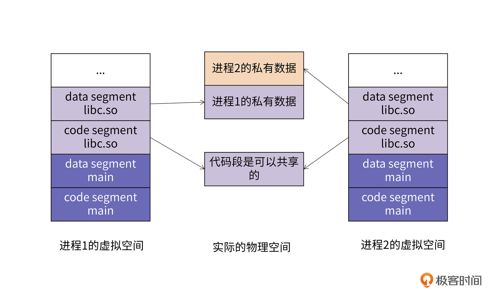
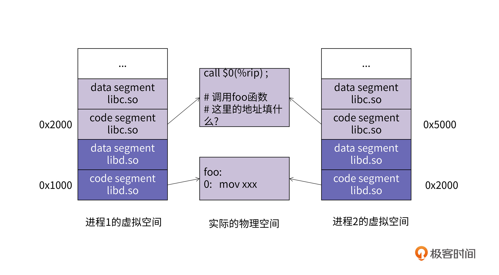
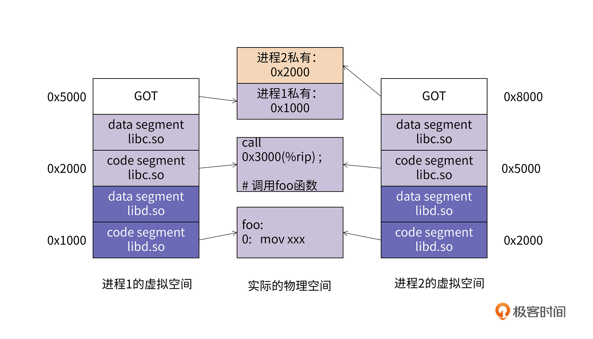

# 07 | 动态链接（上）：地址无关代码是如何生成的？
你好，我是海纳。

通过上节课的学习，我们了解到，链接器可以将不同的编译单元所生成的中间文件组合在一起，并且可以为各个编译单元中的变量和函数分配地址，然后将分配好的地址传给引用者。这个过程就是静态链接。

静态链接可以让开发者进行模块化的开发，大大的促进了程序开发的效率。但同时静态链接仍然存在一个比较大的问题，就是无法共享。例如程序A与程序B都需要调用函数foo，在采用静态链接的情况下，只能分别将foo函数链接到A的二进制文件和B的二进制文件中，这样导致系统同时运行A和B两个进程的时候，内存中会装载两份foo的代码。那么如何消除这种浪费呢，这就是我们接下来两节课的主题：动态链接。

动态链接的重定位发生在加载期间或者运行期间，这节课我们将重点分析加载期间的重定位，它的实现依赖于地址无关代码。我们知道，深入地掌握动态链接库是开发底层基础设施必备的技能之一，如果你想要透彻地理解动态链接机制，就必须掌握地址无关代码技术。

在你掌握了地址无关代码技术后，你还将对程序员眼中的“风骚”操作，比如，如何通过重载动态库对系统进行热更新，如何对动态库里的函数进行hook操作，以便于调试和追踪问题等等，都会有更深入的理解。

我们先来一起看一下，动态链接是怎样解决静态链接不能充分共享代码这个问题的。

## 什么是动态链接

要想解决静态链接的问题，可以把共享的部分抽离出来，组成新的模块。为了让一些公共的库函数能够被多个程序，在运行的过程中进行共享，我们可以让程序在链接和运行过程中，也拆分成不同的模块，即共享模块和私有模块。共享模块用来存放供所有进程公共使用的库函数，私有模块存放本进程独享的函数与数据。

分析到这里，动态链接的基本思路就呼之欲出了。目前解决共享问题，采用的通用的思路是，将常用的公共的函数都放到一个文件中，在整个系统里只会被加载到内存中一次，无论有多少个进程使用它，这个文件在内存中只有一个副本，这种文件就是动态链接库文件。

它在Linux里是共享目标文件(share object, so)，在windows下是动态链接库文件(dynamic linking library, dll)。当然，以上只是一个最基本的想法，要想真正实现动态链接的技术还有很多问题需要考虑。接下来，我们来看最主要的两个问题。

**第一个问题是**，由于公共库函数的代码要在多个不同的进程中进行共享，也就是说，不同的进程运行的库的代码是同一份，这就要求共享模块的代码必须是地址无关的，因为每个进程都有自己独立的内存空间，系统loader无法保证共享模块加载的内存地址，对于每个进程而言都是相同的地址。

例如进程A加载的libfoo.so的起始地址可能是0x1000，而进程B加载的libfoo.so的起始地址可能是0x3000，如果libfoo.so里代码访问的函数或者数据是绝对地址的话，那必然会造成进程A与B的冲突。

**第二个问题是**，我们知道，虽然在开发的过程中，开发者可以将程序模块化处理，但还是需要静态链接来将不同模块链接到一起，对符号进行重定位，这样运行时CPU才能知道各个函数、变量的真正地址是什么。

同样的，要想让程序在运行过程中也进行模块化，那就意味着，不同模块之间符号的链接过程，需要推迟到加载时进行了，这也是动态链接(Dynamic Linking)技术名字的由来。

在讲解动态链接的具体实现之前，我们还是先来看下动态链接的小例子，来对动态链接有一个初步的印象。

## 如何生成和使用动态链接库

我们通过运行一个例子来展示动态链接和加载的完整过程：

```
// foo.h
#ifndef _FOO_H_
#define _FOO_H_

void foo();

#endif

// foo.c
#include <stdio.h>
#include "foo.h"
void foo() {
    printf("Hello foo\n");
}

// main_a.c
#include <stdio.h>
#include "foo.h"

int main() {
    printf("A.exe: ");
    foo();
    while(1) {
    }
}

// main_b.c
#include <stdio.h>
#include "foo.h"

int main() {
    printf("B.exe: ");
    foo();
    while(1) {
    }
}

```

以上例子分了三个模块，分别是共享模块的foo.c，两个主程序main\_a.c和main\_b.c，主程序都调用了foo.c中的foo方法，最后放一个死循环用来保证程序不退出，以便于查看进程的相关信息。

我们先把foo.c编译成libfoo.so：

```
$ gcc foo.c -fPIC -shared -o libfoo.so

```

其中-fPIC目的是开启地址无关代码，一会儿我会给你详细解释；-shared意思是告诉链接器生成的目标文件是共享目标文件。

然后我们分别编译main\_a.c 和main\_b.c，来生成可执行文件A.exe和B.exe：

```
$ gcc main_a.c -L. -lfoo -no-pie -o A.exe
$ gcc main_b.c -L. -lfoo -no-pie -o B.exe

```

我先来解释下，这块代码中几个选项的意思。

- -L指定了查找链接库的路径(或者可以通过设置环境变量LIBRARY\_PATH来追加路径)。-L. 就是告诉链接器需要到当前目录下查找共享文件。
- -l则指定了具体链接库的名称，需要注意的是，gcc在处理链接库名称时，会自动加上lib的前缀和.so的后缀，所以，gcc命令选项写的-lfoo，就是告诉链接器查找libfoo.so这个共享目标文件。
- -no-pie是禁止生成地址无关的可执行文件，方便我们查看进程的内存布局。

此时我们执行“ldd A.exe”或者“ldd B.exe”的时候，就可以看到两个可执行文件依赖的so中多了一个libfoo.so:

```
$ ldd A.exe
        linux-vdso.so.1 (0x00007ffebc5ed000)
        libfoo.so => not found
        libc.so.6 => /lib/x86_64-linux-gnu/libc.so.6 (0x00007f07e5ffe000)
        /lib64/ld-linux-x86-64.so.2 (0x00007f07e65f1000)

```

我要提醒你的是，上面的命令在输出过程中，libfoo.so的指向是not found。这是因为libfoo.so所在的路径是当前路径，运行时查找共享库的时候默认并不会来找寻当前路径，因此libfoo.so的指向目前是无法确认的。如果此时执行./A.exe同样也会报错，解决方法就是将当前路径设置到LD\_LIBRARY\_PATH的环境变量中。

```
$ export LD_LIBRARY_PATH=.:$LD_LIBRARY_PATH

```

此时再执行 `ldd A.exe` 就能找到libfoo.so的位置了。运行结果如下所示：

```
$ ldd A.exe
        linux-vdso.so.1 (0x00007ffef1cba000)
        libfoo.so => ./libfoo.so (0x00007fe9d6998000)
        libc.so.6 => /lib/x86_64-linux-gnu/libc.so.6 (0x00007fe9d65a7000)
        /lib64/ld-linux-x86-64.so.2 (0x00007fe9d6d9c000)

```

在上面的例子中，我们提到了两个环境变量LIBRARY\_PATH和LD\_LIBRARY\_PATH，你可能对这两个环境变量的作用不是很清楚，或者容易混淆，在这里我们再对这两个变量的作用进行一下对比区分。这两个环境变量都是用来设置库文件的查找路径的，只不过使用的时机不一样。

其中LIBRARY\_PATH是由链接器来使用的，一般系统默认是gnu ld。对于大部分开发者来讲，如果LIBRARY\_PATH没有设置好，在使用gcc或者clang这些编译器（其实它们都调用了ld这个链接器，真正做事情的是ld）的时候，会碰到类似 `/usr/bin/ld: cannot find -lfoo` 的错误。LIBRARY\_PATH的一个等价的选项就是上文讲的-L指定路径的选项。

而另一个LD\_LIBRARY\_PATH的环境变量是由动态链接器来使用的，即我们通过ldd看到的ld-linux-x86-64.so.2这个库。动态链接器的知识我们会在下一节课中详细展开。目前这里，我们只需要知道这个动态链接器是在程序加载运行时执行的就可以了。

因此，如果LD\_LIBRARY\_PATH没有设置好的话，会碰到类似 `./A.exe: error while loading shared libraries: libfoo.so: cannot open shared object file: No such file or directory` 的问题。

总结下来，LIBRARY\_PATH的使用时机是链接器在做链接的时候，LD\_LIBRARY\_PATH的使用时机是在程序运行时。

接下来我们再看一下可执行程序运行起来以后，它的内存布局是什么样子的，这样我们就能清楚动态链接技术是怎么节省内存的。

## 动态链接库内存布局

我们通过执行两个进程，一起看下它们的内存布局：

```
$ ./A.exe &
$ ./B.exe &
$ cat /proc/`pidof A.exe`/maps
00400000-00401000 r-xp 00000000 08:10 747270         ./A.exe
00600000-00601000 r--p 00000000 08:10 747270         ./A.exe
00601000-00602000 rw-p 00001000 08:10 747270         ./A.exe
01e58000-01e79000 rw-p 00000000 00:00 0              [heap]
…
7fb25b13d000-7fb25b141000 rw-p 00000000 00:00 0
7fb25b141000-7fb25b142000 r-xp 00000000 08:10 747268 ./libfoo.so
7fb25b142000-7fb25b341000 ---p 00001000 08:10 747268 ./libfoo.so
7fb25b341000-7fb25b342000 r--p 00000000 08:10 747268 ./libfoo.so
7fb25b342000-7fb25b343000 rw-p 00001000 08:10 747268 ./libfoo.so
…
7ffed501b000-7ffed503c000 rw-p 00000000 00:00 0      [stack]
7ffed51bc000-7ffed51c0000 r--p 00000000 00:00 0      [vvar]
7ffed51c0000-7ffed51c1000 r-xp 00000000 00:00 0      [vdso]

$ cat /proc/`pidof B.exe`/maps
00400000-00401000 r-xp 00000000 08:10 747269         ./B.exe
00600000-00601000 r--p 00000000 08:10 747269         ./B.exe
00601000-00602000 rw-p 00001000 08:10 747269         ./B.exe
01597000-015b8000 rw-p 00000000 00:00 0              [heap]
…
7f2991e85000-7f2991e89000 rw-p 00000000 00:00 0
7f2991e89000-7f2991e8a000 r-xp 00000000 08:10 747268 ./libfoo.so
7f2991e8a000-7f2992089000 ---p 00001000 08:10 747268 ./libfoo.so
7f2992089000-7f299208a000 r--p 00000000 08:10 747268 ./libfoo.so
7f299208a000-7f299208b000 rw-p 00001000 08:10 747268 ./libfoo.so
…
7f29922b6000-7f29922b7000 rw-p 00000000 00:00 0
7fff73f9e000-7fff73fbf000 rw-p 00000000 00:00 0      [stack]
7fff73fde000-7fff73fe2000 r--p 00000000 00:00 0      [vvar]
7fff73fe2000-7fff73fe3000 r-xp 00000000 00:00 0      [vdso]

```

从上面的命令运行结果中，我们可以观察到这样两个特点：

第一个特点是，动态库的数据段和代码段是靠在一起的，它并没有和可执行程序的数据段，代码段分别合并，这是与静态链接不同的地方。

第二个特点是，同一个动态库文件在两个进程中的虚拟地址并不相同，A.exe跟B.exe同时加载了libfoo.so，但所处的位置分别是0x7fb25b141000与0x7f2991e89000，并不相同。

然后我们再看一下两个进程中libfoo.so代码段的物理内存占用情况，先看A进程的：

```
$ cat /proc/`pidof A.exe`/smaps
7fb25b141000-7fb25b142000 r-xp 00000000 08:10 747268 ./libfoo.so
Size:                  4 kB
KernelPageSize:        4 kB
MMUPageSize:           4 kB
Rss:                   4 kB
Pss:                   2 kB
......

```

再看看B进程的：

```
$ cat /proc/`pidof B.exe`/smaps
7f2991e89000-7f2991e8a000 r-xp 00000000 08:10 747268 ./libfoo.so
Size:                  4 kB
KernelPageSize:        4 kB
MMUPageSize:           4 kB
Rss:                   4 kB
Pss:                   2 kB
.......

```

我们通过smap的结果来考察物理内存的实际占用情况。在 [第1节课](https://time.geekbang.org/column/article/430073) 的练习中，我曾经让你自己动手研究smap各字段的含义，今天我们来重点分析一下Rss与Pss。Rss的含义是当前段实际加载到物理内存中的大小，Pss指的是进程按比例分配当前段所占物理内存的大小。

在这个例子中，因为libfoo.so本身代码段不足4K，但是物理页的单位是4K，所以这里libfoo.so代码段本身需要占据一个物理页，也就是4K的大小，即Rss值为4K。

由于多个进程共享了动态库，所以Pss的计算方式应该是Rss值除以共享进程数。从上面例子可以看到，A.exe与B.exe共享了libfoo.so的代码段，按比例分配的话应该分别占用2K，即Pss的值都是2K。如果此时我们把B.exe进程终止掉，你会发现A.exe这里的Pss值就会变成4K。命令的输出还包含其他字段，如果你感兴趣的话，可以通过 `man proc` 命令来查询proc的详细信息。

通过这个小例子，我们看到了动态链接技术确实是将共享部分的内存省了下来，但是你也会发现，库文件在不同进程的映射中，虚拟内存地址可以不同。这就要求编译器在生成代码时能适应这个需求，那么地址无关代码技术就诞生了。

## 为什么会有地址无关代码？

首先，我们思考一下，动态库文件被加载到内存中并且被多个进程共享时，它的内存是什么样子的。

在 [第3节课](https://time.geekbang.org/column/article/431904) 我们已经看到了，可执行文件或者动态库文件被加载进内存的时候，文件中不同的section会被加载进内存中不同segment，比如.data和.bss段被加载进数据段(data segment)，而.code, .rodata被加载进代码段(code segment)。

在多进程共享动态库的时候，因为代码段是不可写的，所以进程间共享不存在问题，而数据段可写，系统必须保证一个进程写了共享库的数据段，另外一个进程看不到。这时的内存映射情况如下图所示：



上面这幅图与 [第1节课](https://time.geekbang.org/column/article/430073) 中的页面映射的图几乎如出一辙。正是虚拟地址技术让我们在进程间共享动态库变得容易，我们只需要在虚拟空间里设置一下到物理地址的映射即可完成共享。

虽然libc.so在物理内存中只有一份，但它可以被多个进程进行映射。 **而且进程1映射libc.so代码段的虚拟地址与进程2映射libc.so代码段的虚拟地址可以不相等**。正如本节课开头所分析的，这样做可以使得多个进程共享一份代码，大大节约了内存。

到目前为止，动态库技术看上去都非常好。但不知道你有没有发现一个问题？如果共享的动态库超过了两个，并且这些动态库之间还有相互引用的时候，情况就变得复杂了。我们还是用图来说明：



如上图所示，如果两个进程共享了libc.so和libd.so两个动态库，而且libc中会调用libd中定义的foo方法。

进程1将foo方法映射到自己的虚拟地址0x1000处，而调用foo方法的指令被映射到0x2000处，那么call指令如果采用依赖rip寄存器的相对寻址的办法，这个偏移量应该填-0x1000。进程2将foo方法映射到自己虚拟地址0x2000处，调用foo方法的指令被映射到0x5000处，那么call指令的参数就应该填-0x3000。这就产生了冲突。

显然，我们第6节课所讲的通过rip寄存器进行相对寻址的办法在这里行不通了，相对寻址要求目标地址和本条指令的地址之间的相对值是固定的，这种代码就是地址有关的代码。当目标地址和调用者的地址之间的相对值不固定时，就需要地址无关代码技术了。

## 地址无关代码的核心结构

在计算机科学领域，有一句名言：“计算机领域的所有问题都可以使用新加一层抽象来解决”。这句话的应用在计算机领域随处可见。同样地，要实现代码段的地址无关代码，思路也是通过添加一个中间层，使得对全局符号的访问由直接访问变成间接访问。

我们可以引入一个固定地址，让引用者与这个固定地址之间的相对偏移是固定的，然后这个地址处再填入foo函数真正的地址。当然，这个地方必然位于数据段中，是每个进程私有的，这样才能做到在不同的进程里，可以访问不同的虚拟地址。这个新引入的固定地址就是 **全局偏移表(Global Offset Table, GOT)**。GOT的工作原理如下图所示：



在上图中，call指令处被填入了0x3000，这是因为进程1的GOT与call指令之间的偏移是0x5000-0x2000=0x3000，同时进程2的GOT与call指令之间的偏移是0x8000-0x5000=0x3000。所以对于这一段共享代码，不管是进程1执行还是进程2执行，它们都能跳到自己的GOT表里。

然后，进程1通过访问自己的GOT表，查到foo函数的地址是0x1000，它就能真正地调用到foo函数了。进程2访问自己的GOT表，查到foo函数的地址是0x2000，它也能顺利地调用foo函数。这样我们就通过引入了GOT这个间接层，解决了call指令和foo函数定义之间的偏移不固定的问题。

这种技术就是地址无关代码(Position Independent Code, PIC)。接下来我们用一个实际例子让你加深对PIC技术的理解。

与第6节课讲解linker相似，我们继续用具体的例子来看一下PIC技术中对几种常见类型的地址访问是如何处理的。例子如下：

```
// foo.c

static int static_var;
int global_var;
extern int extern_var;
extern int extern_func();

static int static_func() {
    return 10;
}

int global_func() {
    return 20;
}

int demo() {
    static_var = 1;
    global_var = 2;
    extern_var = 3;
    int ret_var = static_var + global_var + extern_var;
    ret_var += static_func();
    ret_var += global_func();
    ret_var += extern_func();
    return ret_var;
}

```

例子中分别从指令、数据和它的作用域的角度区分了如下几种类型：

1. static\_var，表示静态变量的访问；
2. static\_func，表示静态函数的访问；
3. extern\_var，表示外部变量的访问；
4. extern\_func，表示外部函数的访问；
5. global\_var，表示全局变量的访问；
6. global\_func，表示全局函数的访问；

demo()函数是用来对以上几种类型进行访问来查看代码的生成。

我们把上边的例子编译成so文件，然后反汇编看一下demo函数的汇编是怎样的。

```
$ gcc foo.c -fPIC -shared -fno-plt -o libfoo.so
$ objdump -S libfoo.so
0000000000000680 <demo>:
 680:   55                      push   %rbp
 681:   48 89 e5                mov    %rsp,%rbp
 684:   48 83 ec 10             sub    $0x10,%rsp
 688:   c7 05 92 09 20 00 01    movl   $0x1,0x200992(%rip)        # 201024 <static_var>
 68f:   00 00 00
 692:   48 8b 05 27 09 20 00    mov    0x200927(%rip),%rax        # 200fc0 <global_var-0x68>
 699:   c7 00 02 00 00 00       movl   $0x2,(%rax)
 69f:   48 8b 05 4a 09 20 00    mov    0x20094a(%rip),%rax        # 200ff0 <extern_var>
 6a6:   c7 00 03 00 00 00       movl   $0x3,(%rax)
 6ac:   8b 15 72 09 20 00       mov    0x200972(%rip),%edx        # 201024 <static_var>
 6b2:   48 8b 05 07 09 20 00    mov    0x200907(%rip),%rax        # 200fc0 <global_var-0x68>
 6b9:   8b 00                   mov    (%rax),%eax
 6bb:   01 c2                   add    %eax,%edx
 6bd:   48 8b 05 2c 09 20 00    mov    0x20092c(%rip),%rax        # 200ff0 <extern_var>
 6c4:   8b 00                   mov    (%rax),%eax
 6c6:   01 d0                   add    %edx,%eax
 6c8:   89 45 fc                mov    %eax,-0x4(%rbp)
 6cb:   b8 00 00 00 00          mov    $0x0,%eax
 6d0:   e8 95 ff ff ff          callq  66a <static_func>
 6d5:   01 45 fc                add    %eax,-0x4(%rbp)
 6d8:   b8 00 00 00 00          mov    $0x0,%eax
 6dd:   ff 15 ed 08 20 00       callq  *0x2008ed(%rip)        # 200fd0 <global_func+0x20095b>
 6e3:   01 45 fc                add    %eax,-0x4(%rbp)
 6e6:   b8 00 00 00 00          mov    $0x0,%eax
 6eb:   ff 15 ef 08 20 00       callq  *0x2008ef(%rip)        # 200fe0 <extern_func>
 6f1:   01 45 fc                add    %eax,-0x4(%rbp)
 6f4:   8b 45 fc                mov    -0x4(%rbp),%eax
 6f7:   c9                      leaveq
 6f8:   c3                      retq

```

**1\. 静态变量访问方式**

这里先来看一下static\_var。从demo的汇编里来看，在0x688的位置（第7行），我们可以看到这里对static\_var变量的访问采用的是基于%rip的偏移。其中指令后边的注释标明了当前指令访问的虚拟地址0x201024，通过 `objdump -d libfoo.so` 查看0x201024位置存放的符号是static\_var，在.bss段中。因此可以看出，在同一个共享文件里边，对static变量的访问可以通过%rip偏移的方式来确定数据的位置。

目前我们的讲解都是基于64位的系统，但这里值得一提的是，32位系统下由于没有相对PC偏移的寻址方式，编译器在生成32位PC偏移寻址时，是如下的一段汇编：

```
000003c0 <__x86.get_pc_thunk.bx>:
 3c0:   8b 1c 24                mov    (%esp),%ebx
 3c3:   c3                      ret
 ...
 000004e5 <demo>:
 ...
 4ec:   e8 cf fe ff ff          call   3c0 <__x86.get_pc_thunk.bx>
 4f1:   81 c3 0f 1b 00 00       add    $0x1b0f,%ebx
 4f7:   c7 83 14 00 00 00 01    movl   $0x1,0x14(%ebx)
 ...

```

这里可以看到，32位系统是通过一个call stub来获取的pc的值。因为call指令本身会做的一个操作是将return address压栈，而在\_\_x86.get\_pc\_thunk.bx这个stub里边，则将当前栈顶的值(%esp)取出来放到%ebx寄存器中，那么此时%ebx里存放的就是ret之后的pc的值了。这个设计利用了call指令的会将下一条指令地址压栈的思路，非常巧妙的获取了pc的值，还是很有意思的。

1. **静态函数的访问方式**

静态函数和静态变量一样，都是不能被外部访问的，所以我们也可以推测它的寻址方式和静态变量一样，那么这里我就不再详细讲解验证过程了，请你自己动手验证。

1. **外部变量的访问**

接着来看对extern\_var的访问。demo中对extern\_var的访问是0x69f和0x6a6两条指令。0x69f先将extern\_var的地址mov到rax寄存器中，然后0x6a6则将具体的数据0x3写到extern\_var表示的内存地址中。

可以得到这条指令中使用的实际地址地址是0x6a6 + 0x20094a = 0x200ff0，继续通过objdump来查看对应位置的内容。

```
$objdump -D libfoo.so
 Disassembly of section .got:

0000000000200fc0 <.got>:
        ...

```

这里就是我们刚才讲过的GOT了。其中存放的是该模块需要访问的所有外部符号的地址。这样可以使得对外部符号的访问转换为对GOT表的访问。由于GOT表的相对偏移在同一个so中肯定是不变的，所以对GOT的访问可以使用相对寻址完成。

GOT中指向的是调用目标的在各自进程中的虚拟地址，我们是通过GOT表间接访问的方式，将对外部符号地址的直接依赖消除了。

每个进程都有自己的私有GOT段，GOT中记录了当前的so文件所引用的所有外部符号。这些外部符号都需要进行解析和重定位。这个工作由loader负责，其为符号分配并记录地址，然后将这些地址回写进GOT表。这个过程的原理和上节课所讲的两阶段重定位过程几乎一致，区别仅仅是linke操作的是文件中的地址，而loader操作的是内存地址。

1. **外部函数访问**

例子中0x6eb位置是对extern\_func的调用处，同外部数据访问类似，这里也是采用了GOT表的间接访问的方式，GOT表0x200fe0的位置存放的是extern\_func的运行时地址，也需要在启动时进行重定位。

1. **全局变量和全局函数的访问**

从例子中可以看到，对于全局变量和全局函数的访问的处理方式，与外部变量和外部函数的访问方式是保持一致的，都是采用GOT的方式，因此在这里我就不再详细解释了，你可以去上面的例子中看一下。

## 总结

为了节约内存，让进程间可以共享代码，人们把可以被共享的代码都抽出来，放到一个文件中，多个进程共享这个文件就可以了。这个可共享的文件就是动态库文件。动态库文件中的符号要在加载时才被解析，所以这种技术就叫动态链接技术。

动态库文件被加载进内存以后，在物理内存只有一份，多个进程都可以将它映射进自己的虚拟地址空间。各个进程在映射时可以将动态库的代码段映射到任意的位置。

如果两个共享库之间有引用关系的话，引用者和被引用者之间的相对位置就不能确定了，这时就需要引入地址无关代码技术。对于内部函数或数据访问，因为其相对偏移是固定的，所以可以通过相对偏移寻址的方式来生成代码；对于外部和全局函数或数据访问，则通过GOT表的方式，利用间接跳转将对绝对地址的访问转换为对GOT表的相对偏移寻址，由此得到了地址无关的代码。

地址无关的代码除了可以在so中使用，同样可以在可执行文件中使用，可以通过-pie选项使得gcc编译地址无关的可执行文件。地址文件的可执行文件可以被加载到内存的任意位置执行，这会使得缓冲区溢出的难度增加（你可以结合 [第4节课](https://time.geekbang.org/column/article/433530) 思考一下原因），但代价是通过GOT访问地址会多一次访存，性能会下降。

通过今天这节课，我们对动态链接和其中地址无关代码技术有了整体的认知，但在这里面仍然可以看到引入动态链接带来的一些问题。下节课，我们会进一步探讨动态链接的优化，以及动态链接器与loader的实现。

## 思考题

我们在 [第3节课](https://time.geekbang.org/column/article/431904) 讲过二进制文件的.text段会被加载进内存的代码段(code segment)，请你想一想，.got段加载进内存的什么位置是比较合理的？


好啦，这节课到这就结束啦。欢迎你把这节课分享给更多对计算机内存感兴趣的朋友。我是海纳，我们下节课再见！