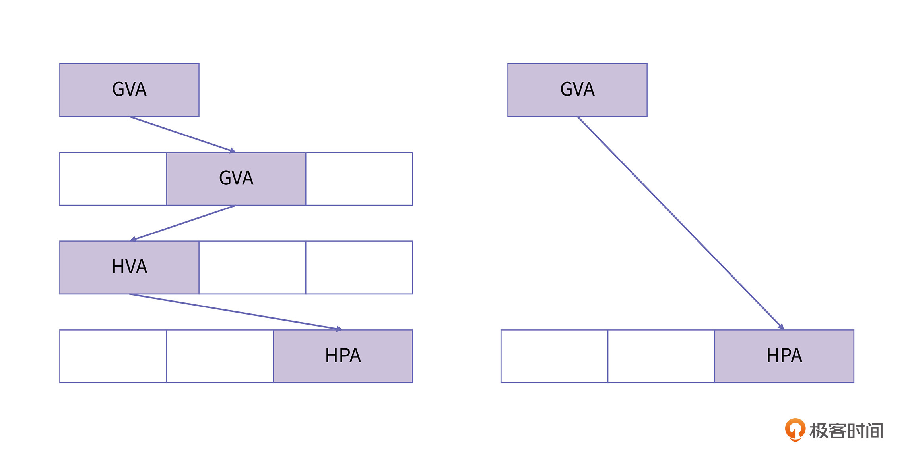
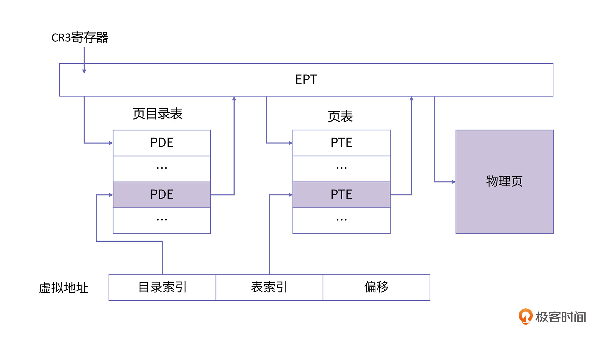
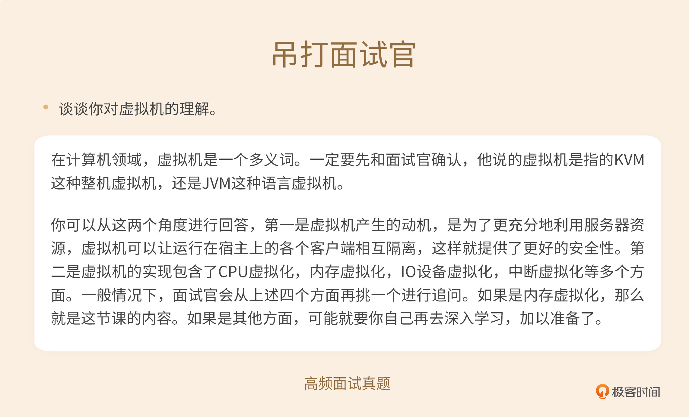

# 12 | 内存虚拟化：云原生时代的奠基者
你好，我是海纳。

今天的这节课呢，是软件篇中的最后一节课了，在前面的课程里，我们整体介绍了单机系统上内存管理的基础知识。这节课，我们就结合前面学习的内容，一起来探讨下，虚拟化中的内存管理，因为我们前面讲过了内存知识，在这个基础上，你再来学习虚拟化中的内存管理，就会简单多了。

当前，云计算已经成为各种网络服务的主流形式，但云计算不是一蹴而就的，它的发展也经过了长期的探索和演变。在演变的过程中，扮演核心角色的就是主机虚拟化技术。它经历了虚拟机和容器两大阶段，其中 **虚拟机以VMWare和KVM等为代表，容器以Docker为代表**。

虽然现在Docker技术非常火爆，甚至某种程度上，人们在讨论云化的时候往往就是指容器化，但是虚拟机技术在长期的发展中，也留下了非常宝贵的技术积累，这些积累在各种特定的场景里还在发挥着重要作用。

举一个我曾经遇到过的一个真实案例：在Windows上快速预览Android游戏。这个操作听起来很神奇是吧，那如何才能打破架构上的壁垒，达到快速执行的目的呢？这就需要对虚拟化的基本原理掌握得比较好，从而在虚拟机层面做很多优化。所以掌握虚拟化技术绝不仅仅只应用于云服务的场景，它可能会在各种意想不到的场景中发挥奇效。

这节课，我将带你从内存入手来学习虚拟化技术，当然，在学习内存虚拟化之前，我们还是需要先了解一下虚拟化技术中的一些关键技术点，以及几个核心的角色，这些背景是贯穿虚拟化技术的核心所在。

## 虚拟化技术的基本概念和原则

我们先来进行一下名词解释， **在虚拟化技术中涉及的有三个核心角色，分别是宿主机，客户机和虚拟机监控器**。宿主机，也被称为Host，一般指代物理主机。客户机，也被称为Guest，是指运行在宿主机上的虚拟机。而负责为客户机准备虚拟CPU，虚拟内存等虚拟资源，并同时对客户机进行管理的模块，就是虚拟机监控器(Virtual Machine Monitor , VMM)。

对于传统的物理主机而言，往往有很强大的计算资源，所以通常一台机器上会有多个用户共同使用，这样才能使得主机资源得到充分利用。但是在传统的单机系统里边，多个用户之间往往会相互影响。例如，通过ps命令可以看到系统上其他用户启动的进程，也可以使用kill命令杀死其他用户的进程，这就对隐私性和安全性带来了比较大的挑战。

针对上面的问题， **虚拟化技术可以让用户相互隔离开**。在不同的虚拟机实例中运行的用户，虽然运行在同一个物理主机上，但是相互无法看到对方，这样就很好的保证了虚拟机用户的隐私与安全。 **在所有的虚拟化实现方案中，内置于Linux内核的虚拟化技术，也就是基于内核的虚拟机(Kernel based Virtual Machine, KVM)是影响力比较大的一个**。这也是我们这节课的重点。

第三个比较重要的组件是VMM，有些资料中也把它叫做Hypervisor。正如它的名字的含义，它是负责管理和调度虚拟机的，虚拟机在执行特权指令、处理中断和管理内存等特殊操作时，都需要通过VMM来完成相应功能。了解完虚拟化技术的三个核心角色后，接下来，我来介绍下虚拟化技术在实际工作中需要遵循的指导原则。

1974年，两位计算机科学家Gerald Popek 和 Robert Goldberg发表了一篇重要的论文 《虚拟化第三代体系结构的正式要求》，在这篇论文中提出了虚拟化的三个基本条件：

1. **等价性**，即要求在虚拟机环境中运行的程序，应当与在物理机上运行的程序行为一致，且所有能在物理机上运行的程序都应该能够在虚拟机中运行；
2. **资源限制**，即要求虚拟机使用的资源需要被进行监督和限制，虚拟机不能越界使用到不属于它的资源；
3. **高效性**，即要求在虚拟机中运行的程序与在物理机中运行的程序相比，性能应该无明显的损耗。

这三个条件便为后续的虚拟化技术的发展提供了有效的指导原则，设计良好的虚拟化技术需要同时满足以上三个条件。

第一个等价性的条件自然不需要过多解释，如果Guest里运行的程序结果都不能保证，那么虚拟化的技术就没有任何意义了。因此， **等价性是虚拟化技术中最基本的要求**。

至于第二个资源限制的条件也比较容易理解， **我们使用Guest的目的本身就是为了对资源使用进行限制与管理，防止不同用户之间对计算机资源的相互干扰，这也是我们考虑使用虚拟化技术时最重要的原因**。

在前两个条件的约束下，我们可以很容易想到一个实现虚拟化技术的方案是： **通过纯软件模拟CPU执行过程**。也就是说，这里需要对完整的底层硬件进行模拟，包括处理器、物理内存和外部设备等等。这样的话，Guest的所有程序都相当于运行在Host的一个解释器里，来一条指令就解释一条指令，资源限制以及运行等价的要求都很容易满足。

不过这个方案的缺陷也非常明显，就是无法满足三个条件里面的高效性。因为你是用软件来对CPU的指令进行了翻译，通常一条指令最终会被翻译成非常多的指令，那效率自然也是非常低的。既然对指令进行翻译的效率是如此低下，那我们为什么不能让Guest程序的代码直接运行在Host的CPU上呢？

我们本来翻译指令的目的，是为了让VMM能够对Guest执行的指令进行监管，防止Guest对计算资源的滥用，那如果又让Guest的执行直接运行在CPU上，VMM又哪里有机会能够对Guest进行监管呢？

为了解决这个问题。人们提出一个重要的模型，这就是 **陷入模拟（Trap-and-Emulate）模型**。接下来，我们就来了解一下吧。

## Trap-and-Emulate模型

陷入模型的核心思想是： **将Guest运行的指令进行分类，一类是安全的指令，也就是说这些指令可以让Host的CPU正常执行而不会产生任何副作用，例如普通的数学运算或者逻辑运算，或者普通的控制流跳转指令等；另一类则是一些“不安全”的指令，又称为“Trap”指令，也就是说，这些指令需要经过VMM进行模拟执行，例如中断、IO等特权指令等**。

接下来，我们来看一下它的具体实现过程：对于“安全”的指令，Guest在执行时可以交由Host的CPU正常运行，这样可以保证大部分场景的性能。不过，当Guest执行一些特权指令时就需要发出Trap，通知VMM来接管Guest的控制流。VMM会对特权指令进行模拟(Emulate)，从而达到资源控制的效果。当然在进行模拟的过程中需要保证执行结果的等价性。

经过这样一个Trap-and-Emulate的过程，Guest就可以在保障等价性以及资源限制的前提下，尽可能地满足虚拟化的高效性的条件。

可能你对此感知不深，下面我给你举一个例子，你就能理解Trap-and-Emulate到底是怎么回事了。

以0x80号中断为例，在 [第2节课](https://time.geekbang.org/column/article/431400) 里，我们使用0x80号中断，调用了write这个系统调用，在控制台上打印文字。"int 0x80"这条指令就是一个特权指令，它会导致当前进程切入内核态执行。在虚拟化场景下遇到这种特权指令，我们不能直接交给宿主机的真实CPU去执行，因为宿主机CPU会使用宿主机的IDT来处理这次中断请求。

而我们真正希望的是， **使用客户机的IDT去查找相应的中断服务程序**。这就需要Guest退回到VMM，让VMM模拟CPU的动作去解析IDT中的中断描述符，找到Guest的中断服务程序并调用它。在这个例子中，Geust退回VMM的操作就是Trap，VMM模拟CPU的动作去调用Guest的中断服务程序就是Emulate。

现在，我们有了整体的方案，不过，这里仍然存在一个问题：当Guest的内核代码在Host的CPU上执行的时候，Guest没有办法区分“安全”指令和“非安全”指令，也就是说Guest不知道哪条指令应该触发Trap。幸好，现代的芯片对这种情况做了硬件上的支持。

现代的X86芯片提供了VMX指令来支持虚拟化，并且在CPU的执行模式上提供了两种模式： **root mode和non-root mode，这两种模式都支持ring 0 ~ ring 3三种特权级别**。VMM会运行在root mode下，而Guest操作系统则运行在non-root mode下。所以，对于Guest的系统来讲，它也和物理机一样，可以让kernel 运行在ring 0的内核态，让用户程序运行在ring 3的用户态， 只不过整个Guest都是运行在non-root 模式下。

有了VMX硬件的支持，Trap-and-Emulate就很好实现了。Guest可以在non-root模式下正常执行指令，就如同在执行物理机的指令一样。当遇到“不安全”指令时，例如I/O或者中断等操作，就会触发CPU的trap动作，使得CPU从non-root 模式退出到root模式，之后便交由VMM进行接管，负责对Guest请求的敏感指令进行模拟执行。这个过程称为 **VM Exit**。

而处于root模式下的VMM，在一开始准备好Guest的相关环境，准备进入Guest时，或者在VM Exit之后执行完Trap指令的模拟准备，再次进入Guest的时候，可以继续通过VMX提供的相关指令VMLAUNCH以及VMResume，来切换到non-root 模式中由Guest继续执行。 这个过程也被称为 **VM Entry**。

在理解了VMM的基本工作原理以后，我们就可以探讨虚拟化场景下的内存管理了。接下来，我们从虚拟机用户的视角出发，来看看VMM是如何支持Guest的内存管理的。

## Guest内存管理

既然讲到内存管理，我们先来研究下物理机和虚拟机分别是怎么获取系统的内存信息的。

在x86架构的实模式下，系统启动时，BIOS ROM会被映射到内存的0xF0000 ~ 0xFFFFF的位置。CPU上电后会从0xFFFF0的位置开始执行，这里会跳转到BIOS的起始代码中。BIOS的代码会检查物理内存的信息，并记录下来。

之后，操作系统可以通过查询INT 15h的中断，来获取物理内存的信息，然后根据寄存器AX值的不同来返回不同的内存信息。当AX值设置为0xE820时，将返回所有已安装 RAM 以及 BIOS 保留的物理内存范围的内存映射。我们看到，在物理机下，是通过INT 15h这个中断来获取系统的内存信息的。

类比下来，如果虚拟机里边想要获取系统的内存信息的话，就需要VMM模拟物理机BIOS的行为。在系统启动时，VMM会将模拟BIOS的代码直接放到内存的0xF0000 ~ 0xFFFFF的位置。在构建中断向量表的时候，则将第0x15位置的中断函数地址设置为虚拟的内存查询函数地址。而调用INT 15h的中断时，中断服务程序返回的是用户配置的Guest的内存信息。这样的话，就可以使得Guest以为自己已经获取了实际物理机的内存信息。

我们知道， **在x86的架构上，系统启动时需要先在实模式下完成系统的引导，然后才会进入保护模式**。同样， **Guest在启动过程中也需要先通过实模式进行引导，再切换到保护模式下**。所以，我们学习Guest的访存机制也是需要分别考虑实模式跟保护模式下的不同处理方式。

### 实模式Guest的访存

正常情况下，当一个Host系统中启动运行Guest系统时，此时的Host是处于保护模式的，而Guest则因为刚启动，所以需要运行在实模式下。此时又碰到一个问题，Guest里实模式的代码又如何运行在Host处于保护模式下的CPU上呢？

这个问题同样需要硬件来支持。在x86体系的CPU中，可以支持一种虚拟8086的模式，这个模式又被称为虚拟-实模式，意思是可以让CPU在保护模式下来运行实模式的程序。当然这里虚拟8086模式下访问的地址，并不意味着程序跟实模式一样，就可以直接访问Host的真实物理地址了，只是说在该模式下，程序可以采用同实模式下一样的寻址方式，但访问的地址还是Host的虚拟地址，但在Guest自己看来，它认为自己访问的是Guest的物理地址(Guest Physical Address,GPA)。

这种情况下，Guest代码中的逻辑地址到Host的物理地址（Host Physical Address, HPA）的转换主要分为三个步骤：

1. 我们知道实模式下程序访存时是通过段式寻址的方式，也就是说，Guest程序的逻辑地址可以通过分段机制转换为GPA，这个过程是由Guest模式下CPU自发地进行，需要CPU运行在上边提到的虚拟8086模式下；
2. Guest的物理内存可以由VMM转换到Host的虚拟内存地址（Host Virtual Address，HVA）。这一步的转换过程可以由VMM内部维护的数据结构进行查表得出；
3. 最后一步的转换也是由VMM直接调用缺页中断服务函数(get\_user\_pages)将Host的虚拟内存映射到物理页。你要注意的是，这一步是VMM主动调用的，而不是由中断触发的。

我们知道，在物理机上进行虚拟地址与物理地址转换的话，需要cr3寄存器来存放页表。因此，在Guest的实模式下，为了能够获取到实际运行的物理地址，我们需要在VM Enter的过程中将cr3寄存器设置成VMM为Guest准备的页表。

在实模式下，因为Guest指令访问都是物理地址，所以cr3寄存器还需要放置负责映射GPA到HPA的页表基址。在初始状态下，VMM只需要准备一个根页面就可以了，等运行到缺页异常时，再通过缺页异常处理函数，来按需要完成页面的映射。

### 保护模式下Guest的访存

我们说，运行在实模式的Guest只需要一个页表就可以完成GPA到HPA的映射。但在保护模式下，我们知道每个进程都有自己的页表，维护着GVA到GPA的映射。所以保护模式下的内存转换方式要更加复杂。

在保护模式下的进程，当Guest准备访存时，cr3寄存器此时存放的是Guest的页表。如果将这个页表交给MMU去查询，得到的将是GPA的地址，而不是真正的HPA地址。这是因为从GVA到HPA之间存在三层映射关系，即：

- **GVA到GPA的映射**；
- **GPA到HVA的映射**；
- **HVA到HPA的映射**。

但MMU却只有一个。因此，要解决这个问题，我们需要将cr3寄存器中指向的Guest的页表，替换成为一张从GVA到HPA映射的页表。当Guest再进行访存时，则可以通过这个页表完成完成从GVA到HPA的转换过程。因为在这个过程中， **新建的这张页表实际上会把Guest本身的页表给遮挡起来，所以我们称这个页表为影子页表(Shadow page table)**。

我们说过，保护模式下每个进程都需要有自己的页表，同样的，VMM也需要为Guest的每个进程维护一个影子页表。在Guest的进程切换过程，要更新cr3寄存器指向的页表地址，VMM要把这个操作拦截下来，将Guest页表换成影子页表。影子页表的示意图如下所示：

可以看到，影子页表将原来的三级映射压缩成了一级映射，CR3寄存器里只要存储影子页表的地址就可以了。这样MMU就可以自动完成从GVA到HPA的转换。

明白了影子页表的作用后，我们接下来看下在KVM里边影子页表是如何实现的。从影子页表的机制中我们可以看出，实现影子页表的过程中有两个关键点：

1. **cr3寄存器的切换；**
2. **影子页表的构建。**

在第一点中，由于进程切换的时候都需要进行页表的切换，也就是对cr3寄存器的修改。因此， **当Guest在进程切换准备把Guest的页表写入cr3寄存器时，需要VMM介入进来，记录下此时要写入的Guest的页表，同时把GVA到HPA映射的影子页表写入到cr3中，完成一次偷梁换柱**。

在第二点中，影子页表的构建，主要是通过影子页表的缺页异常处理函数来完成的，它主要的流程是： **当Guest执行访存指令，来进行访存的时候，会将GVA发送给MMU进行查找。由于此时cr3存放的是影子页表，因此MMU会通过影子页表来查找GVA对应的HPA。如果找到了，就可以直接从HPA中读取对应的数据，然后流程结束**。

如果此时影子页表中还没有GVA到HPA的映射，就会触发VM Exit，并从Guest模式退出到Host模式，由影子页表的缺页处理函数进行处理。影子页表的缺页处理函数会通过上文保存的Guest的页表，来查找GVA对应的GPA。

如果Guest的页表中，GVA到GPA的映射还不存在，就会由VMM向Guest注入缺页异常，并交由Guest的缺页异常处理函数，完成GVA到GPA的映射过程。完成映射后，Guest会继续进行访存，由于此时影子页表中GVA到HPA的映射还未完成，CPU此时会继续进入影子页表的缺页异常处理函数中。

当GVA与GPA的映射已存在时，就只需要根据VMM所维护的映射关系计算出HVA。然后可以借助Host的内存管理机制，来分配空闲的物理页面，并且完成GVA到HPA的映射（与实模式相同，这一步也是由VMM主动调用get\_user\_pages完成的）。最后将映射关系填充到影子页表中。这就完成了影子页表的构建。

影子页表机制实际是一种纯软件实现的机制，我们可以看出， **影子页表是通过软件方式实现了MMU的能力**。而且在影子页表的使用过程中，会多次发生VM Entry和VM Exit，你可以想象的到，影子页表机制的效率非常慢。为了解决这个问题， **硬件厂商通过新增一个页表转换单元来提升性能，这就是扩展页表(Extended Page Table, EPT)**。

## 硬件支持——EPT

芯片厂商们为了提高虚拟化的效率，从硬件实现上支持了2层地址的翻译，其中AMD提出了嵌套页表（Nested Page Table，NPT）的机制，Intel提出的是扩展页表（Extended Page Table，EPT）机制。其实，这两者的实现原理类似，只是命名有所不同。因为Intel的服务器芯片更加常见，所以我们这节课主要还是以Intel的EPT为例来进行讲解。

在增加EPT机制后，相当于有两个地址转换器，其中，MMU负责GVA到GPA的地址转换， 而EPT则负责GPA到HPA的地址转换。两个转换器在硬件上相互配合，MMU根据Guest的页表翻译好GPA并传递给EPT，EPT通过EPT的页表翻译找到HPA的地址进行访存。同时Intel为了处理EPT的缺页，也引入了EPT的缺页异常机制， **它的原理与MMU原理一致**。

EPT的工作原理如下图所示：

上面这幅图与 [第2节课](https://time.geekbang.org/column/article/431400) 中的图非常相似，不同之处在CR3，PDE， PTE中记录都是GPA，而所有的物理地址都要经过EPT的翻译才能找到真正的HPA。

对Guest页表来说，因为每个进程需要一个Guest页表，所以会维护多个Guest的页表。但对于EPT的页表来说，其本质是GPA到HPA的映射页表，因此一个虚拟机只需要维护一个EPT的页表就可以了。

硬件翻译的整个过程对与Guest来讲则是透明的，因此在Guest发生缺页异常则不需要再进行Guest与Host模式之间的切换了，也就节省了大量的上下文切换的开销。

## 总结

这一节课，我们一起学习了虚拟机是如何处理内存的。在这节课的开始部分，我们一起了解了虚拟化技术产生的动机和它的基本原理。

在这个基础上，我们又研究了虚拟机内部是如何管理内存的。在虚拟机Guest启动的时候，宿主机Host肯定是运行在保护模式的，也就是说，分页机制已经开启。但是Guest仍然运行在实模式下，所以Guest会采用虚拟8086模式运行。在这种情况下，因为Guest是直接操作GPA的，所以VMM只需要做好GPA到HPA的转换就行了。

当Guest进入保护模式后，Guest也会维护自己的页表，我们把这个页表叫做虚拟机页表，也就是gPT。显然gPT是不能将Guest的虚拟地址转换成真正的物理地址的，这就需要VMM来做一次处理，将gPT替换为自己精心准备过的页表，也就是影子页表，sPT。

不过，影子页表的维护和切换的效率十分低下，为了解决这个问题，硬件厂商提供了EPT，它可以协助MMU进行第二次页表转换。也就是说，MMU负责将GVA转换为GPA，然后EPT再将GPA转换为HPA，来完成真正的内存页映射。

学习完今天这节课，我相信你已经足够掌握内存虚拟化的大部分知识了。但是虚拟化技术中还有CPU虚拟化、中断虚拟化等等广泛的话题，如果你对虚拟化技术十分感兴趣的话，可以参考 [《KVM虚拟化技术：实战与原理解析》](https://book.douban.com/subject/25743939) 和 [《深度探索Linux系统虚拟化：原理与实现》](https://book.douban.com/subject/35238691) 等书，这样你就可以对虚拟化技术有更全面的掌握了。

## 思考题

在HVA到HPA的转换过程中，当前的实现是主动调用get\_user\_pages来分配物理页，我们又知道VMM运行在内核态，实际上，它是有能力直接为GPA分配物理内存，而不必再借助HVA的，那为什么KVM要选择保留HVA呢？欢迎你在留言区分享你的想法和收获，我在留言区等你。

好啦，这节课到这就结束啦。欢迎你把这节课分享给更多对计算机内存感兴趣的朋友。我是海纳，我们下节课再见！