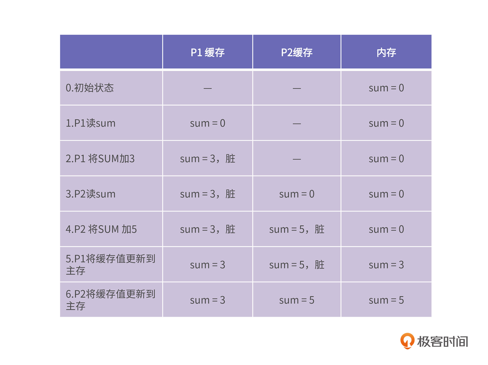
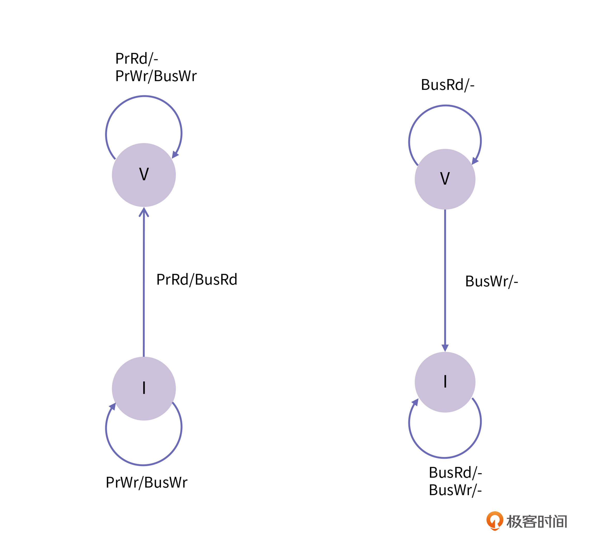
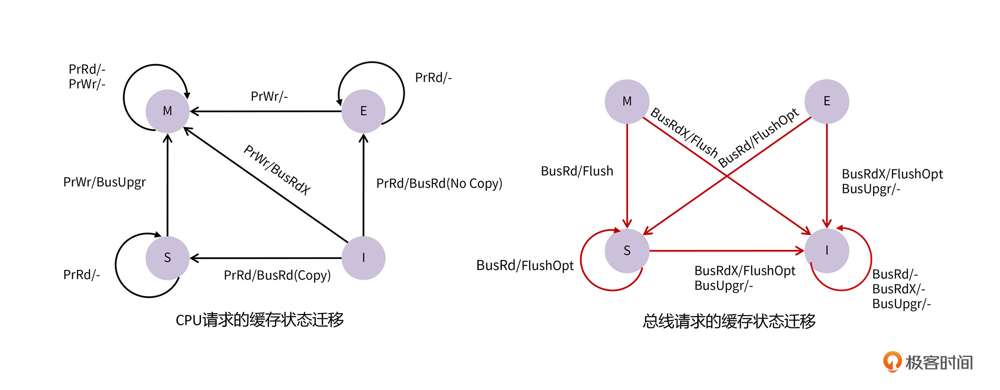

# 15 | MESI协议：多核CPU是如何同步高速缓存的？
你好，我是海纳。

上节课，我们学习了为什么要设计缓存，以及缓存和内存的映射方式。你还记得吗？在上节课结束的部分，我讲到了只要数据的访问者和被访问者之间的速度不匹配，就可以考虑使用缓存进行加速。

但是我们知道，天下没有免费的午餐，缓存在带来性能提升的同时，也引入了缓存一致性问题。缓存一致性问题的产生主要是因为在多核体系结构中，如果有一个CPU修改了内存中的某个值，那么必须有一种机制保证其他CPU能够观察到这个修改。于是，人们设计了协议来规定一个CPU对缓存数据的修改，如何同步到另一个CPU。

今天我们就来介绍在多核体系结构下，如何解决缓存一致性问题。另外，按照从简单到困难的顺序，我还会介绍最简单的VI协议和比较完善的MESI协议。学习完这节课后，你就知道缓存一致性问题是如何被解决的，还会了解到如何设计协议对缓存一致性进行管理。

在缓存一致性的问题中，因为CPU修改自己的缓存策略至关重要，所以我们就从缓存的写策略开始讲起。

## 缓存写策略

在高速缓存的设计中，有一个重要的问题就是：当CPU修改了缓存中的数据后，这些修改什么时候能传播到主存？解决这个问题有两种策略： **写回（Write Back）和写直达（Write Through）**。

当CPU采取写回策略时，对缓存的修改不会立刻传播到主存，只有当缓存块被替换时，这些被修改的缓存块，才会写回并覆盖内存中过时的数据；当CPU采取写直达策略时，缓存中任何一个字节的修改，都会立刻传播到内存，这种做法就像穿透了缓存一样，所以用英文单词“Through”来命名。

同时，当某个CPU的缓存中执行写操作，修改其中的某个值时，其他CPU的缓存所保有该数据副本的更新策略也有两种： **写更新（Write Update）和写无效（Write Invalidate）**。

如果CPU采取写更新策略，每次它的缓存写入新的值，该CPU都必须发起一次总线请求，通知其他CPU将它们的缓存值更新为刚写入的值，所以写更新会很占用总线带宽。如果一个CPU缓存执行了写操作，其他CPU需要多次读这个被写过的数据时，那么写更新的效率就会变得很高，因为写操作执行之后马上更新其他缓存中的副本，所以可以使其他处理器立刻获得最新的值。

如果在一个CPU修改缓存时，将其他CPU中的缓存全部设置为无效，这种策略叫做写无效。这意味着，当其他CPU再次访问该缓存副本时，会发现这一部分缓存已经失效，此时CPU就会从内存中重新载入最新的数据。

在具体的实现中，绝大多数CPU都会采用写无效策略。这是因为多次写操作只需要发起一次总线事件即可，第一次写已经将其他缓存的值置为无效，之后的写不必再更新状态，这样可以有效地节省CPU核间总线带宽。基于这个原因，我们这节课也只讨论写无效策略。

另一个方面是，当前要写入的数据不在缓存中时，根据是否要先将数据加载到缓存中，写策略又分为两种： **写分配（Write Allocate）和写不分配（Not Write Allocate）**。

在写入数据前将数据读入缓存，这是写分配策略。当缓存块中的数据在未来读写概率较高，也就是程序空间局部性较好时，写分配的效率较好；在写入数据时，直接将要写入的数据传播内存，而并不将数据块读入缓存，这是写不分配策略。当数据块中的数据在未来使用的概率较低时，写不分配性能较好。

如果缓存块的大小比较大，该缓存块未来被多次访问的概率也会增加，这种情况下，写分配的策略性能要优于写不分配。这节课，我们将“写直达”与“写不分配”组合起来讲解，把“写回”和“写分配”组合起来讲解，其他的组合情况，做为练习，大家可以根据这两种情况自行推导。

**从缓存和内存的更新关系看，写策略分为写回和写直达；从写缓存时CPU之间的更新策略来看，写策略分为写更新和写无效；从写缓存时数据是否被加载来看，写策略又分为写分配和写不分配。**

在介绍完缓存写策略这些概念之后，我们来具体看下什么是缓存一致性问题。

## 缓存一致性问题

所谓缓存一致性，就是保证同一个数据在每个CPU的私有缓存（一般为L1 Cache）中副本是相同的。考虑下面的例子：

```
global sum = 0

// Thread1：
sum += 3

// Thread2：
sum += 5

```

假设Thread1由CPU核P1执行，Thread2 由P2执行，那么P1、P2的私有缓存和主存的状态可能出现下表所示的情况：



我先带你理解下表格中的信息，然后再结合上面的例子具体分析。在这个表里，脏是缓存块的一个标识位，用来表示缓存中的数据有没有被改写，如果该缓存块的内容被修改，并且还没有同步到主存，就称它为脏的；

sum对于Thread1和Thread2是共享的。初始状态sum的值为0，Thread1将sum加3，Thread2将sum加5。正常来说，我们期望内存中的sum值是8。但实际两个线程执行结束后，内存中的sum的取值根据缓存状态的传播情况，就会有不同的取值。

上表中展示了一种内存中sum值为5的操作序列。但是，第5步和第6步的顺序有可能会对调，所以sum值还有可能是3。如果第3步，P1的缓存中的值能被正确地传播到P2，那么P2的sum值就为8，所以最终内存中的值还有可能是8。

通过上面的例子我们可以看出，为了保证缓存一致性，必须解决两个问题，分别是 **写传播（第3步）和事务串行化（第5和第6步）**。

写传播是指，一个处理器对缓存中的值进行了修改，需要通知其他处理器，也就是需要用到“写更新”或者“写无效”策略。

事务串行化是指，多个处理器对同一个值进行修改，在同一时刻只能有一个处理器写成功，必须保证写操作的原子性，多个写操作必须串行执行。我们将会在下节课对事务串行化进行介绍，这节课只重点关注写传播。

那怎样解决写传播所带来的缓存一致性问题呢？那就需要缓存一致性协议，前面提到缓存中的值同步给主存有两种策略（写回和写直达），而且，不同的写策略，对应不同的缓存一致性协议。所以，接下来我们分别介绍基于写直达和写回的缓存一致性协议。

## 基于“写直达”的缓存一致性协议

写直达的缓存一致性协议是比较简单的，我们假设一个单级缓存，它既可以接收来自处理器的请求，也可以处理来自总线侦听器的总线侦听请求，其中，处理器的请求包含：

- **PrRd**: 处理器请求从缓存块中读出；
- **PrWr**: 处理器请求向缓存块写入。

来自总线的请求包含：

- **BusRd**: 总线侦听到一个来自另一个处理器的读出缓存请求；
- **BusWr**: 总线侦听到来自另一个处理器写入缓存的请求。在“写直达”策略中，BusWr即另一个处理器向内存的写入请求。

每个缓存块都有两种状态，包括：

1. **Valid(V)：缓存块是有效且干净的，意味着该缓存块中的内容与主存中相同**；
2. **Invalid(I)：缓存块无效，访问该缓存块会出现缓存缺失**。

这里我们用一个状态机来表示基于“写直达”一致性协议的缓存块状态变化，也就是缓存一致性协议的本质。如上面所介绍的， **在这里我们只讨论写“写无效”和“写直达”的组合策略**，因为写直达会导致更新直接穿透缓存，所以这种情况下只能采用写不分配策略，所以我们这里讨论的策略组合是写无效、写直达和写不分配。如下图所示：



在上图中，“/”前表示的是请求，这个请求可能来自CPU自己，也可能来自总线，“/”后表示的是当前请求所引起的总线事件，“-”表示不产生总线事件。

我们先看图的左边，这部分代表了当前CPU所发起的操作，考虑缓存块的状态为I。I状态代表了两种情况： **尚未使用的缓存块和无效的缓存块，尚未使用的缓存块其中也没有有效的数据，所以可以与无效的缓存块同等对待**。

先讨论状态I，当处理器发出读请求时，发现缓存缺失，但是要把数据加载进缓存，这时，总线上随即产生一个BusRd请求，内存控制器响应BusRd，将所需的块从内存中取出，取出的块放入缓存中，同时将状态设置为V，表示当前缓存的状态有效。当处理器发出写请求时，因为采用写直达策略，写操作通过BusWr被传递到内存，而不是将数据写入缓存，所以状态仍为无效。

接着考虑状态V。当处理器发出读请求时，该数据在缓存中被找到，缓存命中，不会产生总线事务，缓存块状态不变。当处理器发出写请求时，缓存块被更新，并且这个更新通过BusWr被传递到内存，缓存块的状态保持有效。

接下来我们看图的右边，这部分代表总线发起的请求。我们还是分别讨论状态I和状态V。先讨论状态I，所有侦听到的BusRd和BusWr都不会影响它，保持无效，所以这种情况被忽略。

接着，我们考虑状态V，当一个BusRd被侦听到时，这意味着有其他处理器遇到了缓存缺失，并且需要从主存中取出需要的块，所以该缓存块的状态不用改变，但是当侦听到一个BusWr时，表示有其他处理器想要获取该缓存块的唯一所有权（要保证事务串行化），所以该缓存块的状态变为I。

讨论到这，我们再来看缓存一致性中的数据同步问题，你就能很好的理解了。 **“写传播”的缓存一致性的缺点是需要很高的带宽。原因是对于缓存块的每次写入，都会触发BusWr从而占用带宽。相反的是，在“写无效”缓存策略下，如果同一个缓存块中的数据被多次写入，只需占用一次总线带宽来失效其他处理器的缓存副本即可**。

接下来我们介绍下基于“写回”策略的缓存一致性协议，它也被称为MESI协议。

## MESI协议

同基于“写直达”的缓存一致性协议一样，我们先来了解MESI协议中，处理器对缓存的请求:

- **PrRd**：处理器请求从缓存块中读出；
- **PrWr**：处理器请求向缓存块写入。

而总线对缓存的请求和“写直达”的缓存一致性协议稍有不同，分别是:

- **BusRd**：总线侦听到一个来自另一个处理器的读出缓存请求；
- **BusRdX**：总线侦听到来自另一个尚未取得该缓存块所有权的处理器读独占（或者写）缓存的请求；
- **BusUpgr**：侦听到一个其他处理器要写入本地缓存块上的数据的请求；
- **Flush**：总线侦听到一个缓存块被另一个处理器写回到主存的请求；
- **FlushOpt**：侦听到一个缓存块被放置在总线以提供给另一个处理器的请求，和Flush类似，但只不过是从缓存到缓存的传输请求。

缓存块的状态分为4种，也是MESI协议名字的由来：

- **Modified（M）：缓存块有效，但是是“脏”的，其数据与主存中的原始数据不同，同时还表示处理器对于该缓存块的唯一所有权，表示数据只在这个处理器的缓存上是有效的**；
- **Exclusive（E）：缓存块是干净有效且唯一的**；
- **Shared（S）：缓存块是有效且干净的，有多个处理器持有相同的缓存副本**；
- **Invalid（I）：缓存块无效**。

同样，我们用状态机来表示缓存块状态的变化，如下图所示：



这个状态机看起来比较复杂，首先，图中的黑色箭头表示是由当前处理器发起的，红色箭头表示，这个事件是从总线来的，也就是由其他处理器发起的。

我们先看由处理器发起的请求（黑线部分）：

- **M状态**：读写操作都不会改变状态，并且因为能够确定不会有其他副本，因此不会产生任何总线事务；

- **E状态**：任何对该缓存块的读操作都会缓存命中，且不触发任何总线事务。一个对E状态的写操作，也不会产生总线事务，只需将缓存块状态改为M；

- **S状态**：当处理器读时，缓存命中，不产生总线事务。当处理器写时，需要产生BusUpgr事件，通知其他处理器我要写这个缓存块，并将缓存块状态置为M；

- **I状态**：当处理器发出读请求时，遇到缓存块缺失，要把数据加载进缓存，产生一个BusRd总线请求。内存控制器响应BusRd请求，将所需要的缓存块从内存中取出，同时会检查有没有其他处理器也有该缓存块拷贝，如果发现拷贝则将状态置为S,并且把其他有拷贝的处理器的状态也相应地置为S；如果没有发现其他拷贝，则将状态置为E。


接下来，我们看下由总线发起的请求（红色部分）：

- **M状态**：该缓存块是整个系统里唯一有效的，并且内存的数据也是过时的。因此当侦听到BusRd时，缓存块必须被清空以保证写传播，所以会产生Flush事件。并且将状态置为S。当侦听到BusRdX时，也必须产生Flush事件，因为有其他处理器要写，所以当前缓存块置为I；

- **E状态**：当侦听到BusRd请求时，说明另一个处理器遇到了缓存缺失，并试图获取该缓存块，因为最终的结果是要将这个缓存块，放在不止一个处理器缓存上，所以状态必须被置为S。这样就会产生FlushOpt事件，来完成缓存到缓存的传输。


当BusRdX被侦听到时，说明有其他处理器想要独占这个缓存块上的数据，这种情况下，本地缓存块将会被清空并且状态需要置为I，同时也会产生FlushOpt事件，完成缓存到缓存的传输，将当前数据的最新值同步给需要进行写操作的其他处理器。

而当侦听到BusUpgr时，说明其他处理器要写当前处理器持有的缓存副本，所以要将状态置为I，但是不必产生总线事务；

- **S状态**：当侦听到BusRd时，也就是另一个处理器遇到缓存缺失而试图获取该缓存块，因为S状态本身是共享的，所以状态保持S不变；

- **I状态**：侦听到的BusRd、BusRdX、BusUpgr都不会影响它，所以忽略该情况，状态保持不变。


总体来讲， **MESI协议通过引入了Modified和Exclusive两种状态，并且引入了处理器缓存之间可以相互同步的机制，非常有效地降低了CPU核间带宽。它是当前设计中进行CPU核间通讯的主流协议，被广泛地使用在各种CPU中**。

## 总结

好了，这节课到这里就结束了。这节课我们介绍了缓存的写策略、多核情况下缓存面临的缓存一致性问题，以及如何使用缓存一致性协议来解决这类问题。

因为缓存一致性问题是由CPU对自己的缓存进行写操作，而未能及时通知到其他CPU所引起的，所以缓存的写策略会深刻地影响缓存一致性问题的解决。

从缓存和内存的更新关系看，写策略分为写回和写直达；从写缓存时，CPU之间的更新策略来看，写策略分为写更新和写无效；从写缓存时数据是否被加载来看，写策略又分为写分配和写不分配。其中，写更新和写不分配这两种策略在现实中比较少出现，所以我们这节课就不再对它们展开详细的讨论了。

接着，我们讨论了在写回策略和写直达策略中，缓存的状态和它的状态迁移的情况。状态迁移要考虑两种动作： **一是本CPU所发起的请求，以Pr开头；另一个是其他CPU发起的请求，这些请求最终会通过总线发送过来，以Bus开头**。一个CPU发起请求的同时，还会产生总线事件。

在写回策略中主要包括失效和有效两种状态；在写直达策略中又通过引入独占和修改状态，提升了缓存同步的效率。

你要注意的是， **缓存一致性协议是个约定，具体实现上实际是由硬件电路保证的，虽然我们在写程序时可能没有涉及这方面的知识，但是作为一个资深程序员，了解其背后的原理是非常有必要的**。

## 思考题

你能列举一下在工作中，你还遇到哪些场景需要类似的一致性算法的吗？（小提示：所有类似的有一致性需求的场景，都可以采用类似MESI协议的做法来解决）。欢迎你在留言区分享你的想法和收获，我在留言区等你。


好啦，这节课到这就结束啦。欢迎你把这节课分享给更多对计算机内存感兴趣的朋友。我是海纳，我们下节课再见！