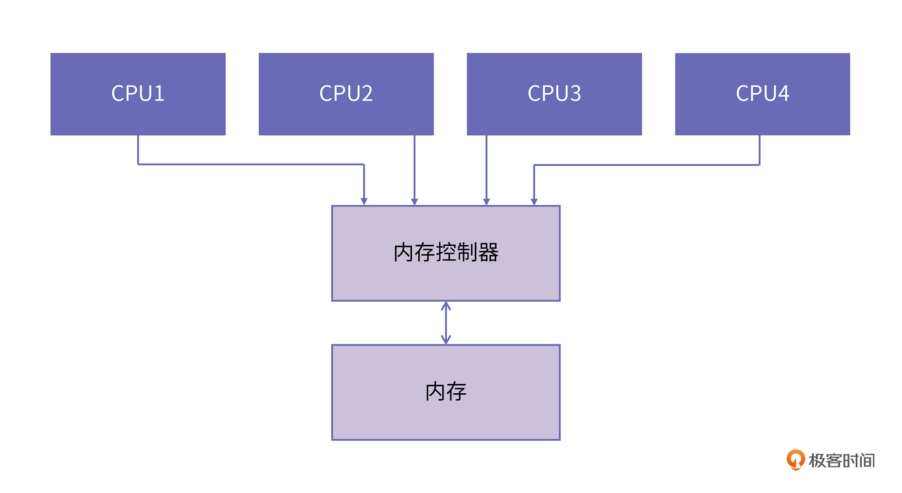
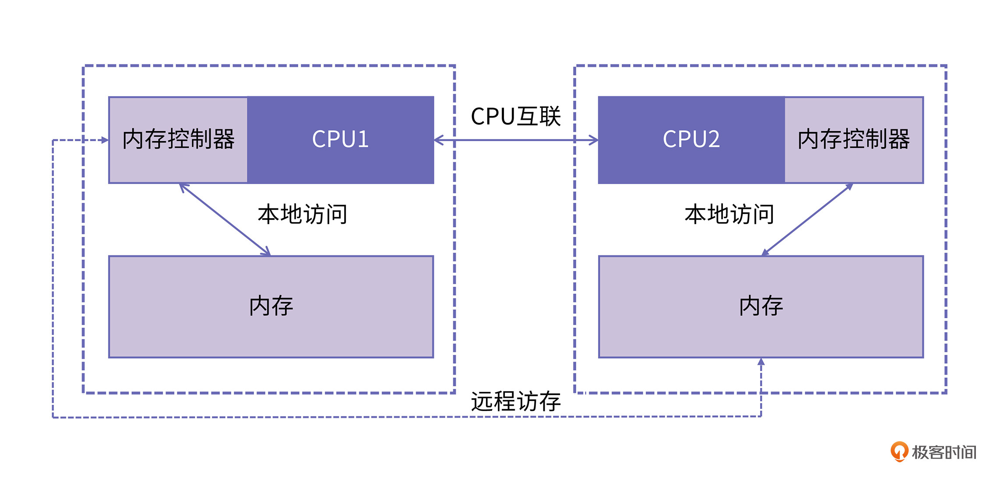
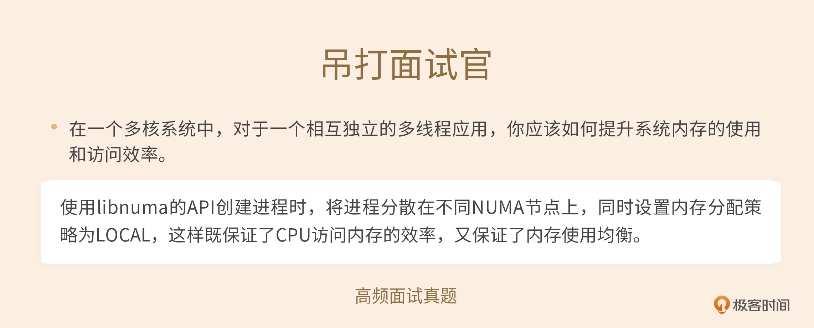

# 17 | NUMA：非均匀访存带来了哪些提升与挑战？
<audio src='./17-NUMA：非均匀访存带来了哪些提升与挑战？.mp3' controls></audio>
你好，我是海纳。

在硬件篇的最后一节课，我们来看两个比较重要的物理内存问题。在 [第1节课](https://time.geekbang.org/column/article/430073)，我们讲到物理内存就是指主存，这句话是不太精确的，其实大型服务器的物理内存是由很多部分组成的，主要包含 **外设所使用的内存和主存**。

这节课，我们先会对计算机是如何组织外设所使用的内存进行分析，因为这是你了解设备驱动开发的基础；接下来，我们将分析主存，不过在展开之前，你还是需要了解一下它的内部结构，才能更好的理解。

如果你从CPU的角度去看，就会发现物理内存并不是平坦的，而是坑坑洼洼的。正是因为这样的特点，也就导致CPU对物理内存的访问速度也不一样。同时，有些内存可以使用CPU Cache，有些则不可以。我们把这种组织方式称为 **异质（Heterogeneity）式** 的结构。

再往深入拆解，在异质式结构中，CPU不仅仅对外设内存和主存的访问速度不一样，它访问主存不同区间的速度也不一样。换句话说， **不同的CPU访问不同地址主存的速度各不相同**，我们把采用这种设计的内存叫做非一致性访存（Non-uniform memory access，NUMA）。

通常，在进行应用程序内存管理时，正确使用NUMA可以极大地提升应用程序的吞吐量；相应地，如果NUMA的配置不合理，也有可能带来比较大的负面影响。而且，在多核体系结构的服务器上，合理地通过控制NUMA的绑定，来提升应用程序的性能，对于服务端程序员至关重要。为了帮助你合理运用NUMA，今天这节课，我们就来详细分析NUMA会为应用程序带来哪些提升与挑战。

NUMA的内容比较多，我放在了这节课的后半部分讲解。我们先来分析计算机是如何组织外设所使用的内存的？

### 再论物理内存

**外设所需要的内存主要包括外设的工作内存、DMA区域和用于IO映射的内存**。在Linux系统上，我们可以使用以下命令查看物理内存分布情况：

```
$ cat /proc/iomem
00000000-00000fff : reserved
00001000-0009fbff : System RAM
0009fc00-0009ffff : reserved
000a0000-000bffff : PCI Bus 0000:00
000c0000-000c8dff : Video ROM
000c9000-000c99ff : Adapter ROM
000f0000-000fffff : reserved
  000f0000-000fffff : System ROM
00100000-3f7fefff : System RAM
  01000000-0172ac34 : Kernel code
  0172ac35-01d1c9bf : Kernel data
  01e74000-01fdbfff : Kernel bss
3f7ff000-3f7fffff : reserved
3f800000-3fffffff : RAM buffer
40000000-47ffffff : System RAM
f0000000-fbffffff : PCI Bus 0000:00
  f0000000-f1ffffff : 0000:00:02.0
    f0000000-f015ffff : efifb
  f2000000-f2ffffff : 0000:00:03.0
    f2000000-f2ffffff : xen-platform-pci
  f3000000-f300ffff : 0000:00:02.0
  f3020000-f3020fff : 0000:00:02.0
  f3021000-f3021fff : 0000:00:04.0
    f3021000-f3021fff : ehci_hcd
fc000000-ffffffff : reserved
  fec00000-fec003ff : IOAPIC 0
  fee00000-fee00fff : Local APIC

```

你会发现，物理内存最重要的三个部分是：

1. **从640K（0xa0000）到1M（0xfffff）区间，是被ISA设备的RAM和ROM占据的**；
2. **从1M开始才是主存（System RAM），同时我们也注意到，主存并不是连续的**；
3. **物理内存的最后256M（0xf0000000到0xffffffff）保留给了PCI设备，用于IO内存映射**。

接下来，我们就对这些内存进行详细地分析。先考察实模式下低于1M的内存，我们说从640K到1M这一段区间是预留给ISA设备的，由于早期的显卡是通过ISA总线和CPU进行通讯的，而现代显卡则是使用PCI/PCIe总线与CPU通讯，显卡作为最典型的外设，我就以它为例对这段内存进行说明。

你可能已经注意到，操作系统在刚启动的时候，显示器上会显示操作系统相关的信息，包括系统版本号、进入BIOS提示信息等内容，不过内容全是字符，没有漂亮的图形界面。在经过了系统引导之后，才有 **图形界面接口**（Graph User Interface，GUI）。

其实，这就是显卡的两种工作模式：一种是 **字符模式**，另一种是 **图形模式**。在字符模式下，只能显示字符。而在图形模式下则可以对屏幕上的每一个像素进行操作。在Linux内核的加载启动阶段，选择了使用字符模式。当CPU进入保护模式以后，才开始初始化各种外设，设置它们的输入输出端口（IO Port）和相关的内存映射，在这之后，显卡才进入图形模式。

在字符模式下，BIOS会将显卡的显存映射到物理地址0xb8000（位于0xa0000~0xfffff区间内）。在实模式下，我们可以通过mov指令向这个地址直接写入数据，然后显示器就会显示对应的内容。例如，以下实模式代码就可以在屏幕的左上角显示白色的字符A：

```
 movw $0xb800, %ax
 movw %ax, %gs
 movl $0x0, %edi
 movb $0xf, %ah
 movb $0x41, %al
 movw %ax, %gs:(%edi)

```

在保护模式下，显存仍然在物理地址0xb8000。但是，在保护模式下，我们只能使用线性地址来进行内存访问，所以操作系统必然要在准备内核空间页表项时，准备好从虚拟地址到物理地址的映射，将显存的物理地址通过页表管理起来。

这种工作方式的显存空间非常小。这是因为早期的VGA显卡也是ISA设备，而ISA设备可以使用的总内存，是从640KB到1MB之间的物理地址空间。在 [导学（一）](https://time.geekbang.org/column/article/430173) 里，我们讲解CPU总线的时候提到过，早期的CPU与外设之间的总线是ISA总线，后来PCI/PCIe总线因为具有更好的扩展性和远超ISA总线的速度得到普及。所以后来的显卡也不再使用这种，提前映射到物理内存的方式了，而是采用PCI总线来和CPU进行通讯，但因为兼容性问题，所以早期的设计得到了保留。

PCI总线上连接的设备称为 **PCI设备**。上面的第三部分内存就是为PCI设备准备的。PCI设备的连接方式和详细的初始化过程，是由PCI Specification规定的。这部分内容属于设备驱动开发需要掌握的知识，与我们的课程关系不大，所以就不再详细介绍了。我们来重点关注CPU是如何与PCI设备通过内存进行交互的。

CPU与外设进行交互主要有两种手段，分别是 **IO端口(IO Port)和IO内存映射（Memory Mapped IO， MMIO）**。IO端口是最基本的手段，在ISA设备上就在应用，它使用in/out等专属指令对外设的寄存器进行操作： **设置、读取状态，以及控制数据传输**。但是IO端口不适合进行大规模的数据传输，所以PCI设备主要还是通过MMIO进行数据通讯。

PCI设备在初始化时，操作系统会通过IO端口读取它的基地址寄存器组（Base Address Registers，BARs），寄存器组里描述了这个设备所需的内存空间的大小。然后，操作系统使用ioremap为它分配虚拟内存。

上面过程的详细步骤如下所示：

1. 为外设分配物理内存。外设的物理内存可能由BIOS或者操作系统分配，如果是由操作系统分配，则需要由驱动程序主动调用request\_mem\_region进行物理地址分配。在32位系统上，往往是4G物理地址的最后256M预留给PCI设备，在64位系统上，则可以分配更多的物理内存；
2. 如果是操作系统负责分配的，则CPU通过IO端口将分配到的物理内存写入PCI设备，通过操作系统统一管理，PCI设备的IO内存就不会冲突了；
3. 使用ioremap分配虚拟地址空间，并映射到上一步获得的物理地址；
4. 使用ioremap返回的虚拟地址空间进行通讯。CPU可以使用普通的mov指令，像访问内存一样去访问外设的内存。

**IO端口主要用于状态读取和设置等控制命令的通讯，而IO内存映射主要用于大量的数据传输**。

在理解了CPU是如何与物理内存中外设所需的内存交互后，我们再详细研究物理内存中最重要的部分：主存。我们在前面提到NUMA是提升应用程序性能的重要手段。接下来我们具体看一看NUMA为我们的应用程序带来了哪些提升和挑战。

### NUMA

在多核服务器上，主存也并不是一段平坦的同质的内存。为了加速性能，人们发明了 **非一致性内存访问**（Non-uniform memory access，NUMA），与之对应的是 **一致性内存访问**（Uniform Memory Access， UMA）。

这里的一致性是指， **同一个CPU对所有内存的访问的速度是一样的，因为物理内存是连续且集中的**。

而非一致性是指， **内存在物理上被分为了多个节点node，CPU可以访问所有节点，但是为了提升访问效率，CPU可以有选择地优先访问离自己近的内存节点**。所以在多核处理器上，CPU也根据内存节点划分成多个组，每个组里的CPU访问同一个内存节点的效率是相同的。当然了，任何一个CPU都可以访问全部的内存节点，只不过因为“距离”远近的关系，访问效率不一样。

回顾历史，一致性内存访问（下称UMA）发展的时间很长，但是随着多核技术的发展，UMA存在的问题和面临的挑战越来越明显。

**因为UMA是基于总线的，CPU需要先经过前端总线（Front Side Bus，FSB）连接到北桥，然后北桥再连接到内存控制器进行内存访问**。如下图所示：



随着处理器核数的增多，UMA面临的挑战主要包括两个方面：

1. **总线的带宽压力会越来越大，同时每个节点可用带宽会减少**；

2. **总线的长度也会因此而增加，进而增加访问延迟**。

为了解决以上两个问题， **NUMA架构逐渐成为主流**。和UMA不同，在NUMA架构下每个 CPU 现在都有自己的本地内存节点，CPU与CPU之间点对点互联。使用这种方式的典型代表是intel的快速通道互联QPI（Intel QuickPath Interconnect）。如果一个CPU要访问远程节点的内存，则先通过QPI到达远程节点CPU的内存控制器，然后再进行数据传输。



如上图所示，连接到 CPU1 的内存控制器的内存被认为是本地内存。连接到另一个 CPU 插槽 (CPU2) 的内存被视为 CPU1 的外部或远程内存。远程内存访问比本地内存访问有额外的延迟开销，因为它必须 **遍历互连**（点对点链接）并连接到远程内存控制器。由于两者内存位置不同，访问方式也不同，因此这种系统会经历“不均匀”的内存访问时间。

UMA架构的优点很明显就是结构简单，所有的CPU访问内存都是一致的，都必须经过总线。然而它缺点我们再前面也提到了，就是随着处理器核数的增多，总线的带宽压力会越来越大。解决办法就只能扩宽总线，然而成本十分高昂，未来可能仍然面临带宽压力。 **而NUMA在扩展时只需要关注CPU之间的连接，不占用总线带宽，自然就成为现代处理器的选择**。

在了解这些知识之后，我们来学习如何发挥NUMA的作用。接下来，我们来介绍numactl工具，方便你学习如何查看和使用NUMA信息。

### 正确使用NUMA

在开始实验之前，建议你找到一台服务器，因为个人电脑一般是不带NUMA的。首先我们可以使用numactl -H 命令，这个命令可以查看到机器上有多少个NUMA节点、每个节点包括哪些处理器核，以及不同节点之间访问速度的差异。如下图所示：

```
available: 4 nodes (0-3)
node 0 cpus: 0 1 2 3 4 5 6 7 8 9 10 11 12 13 14 15 16 17 18 19 20 21 22 23 24 25 26 27 28 29 30 31
node 0 size: 128132 MB
node 0 free: 113084 MB
node 1 cpus: 32 33 34 35 36 37 38 39 40 41 42 43 44 45 46 47 48 49 50 51 52 53 54 55 56 57 58 59 60 61 62 63
node 1 size: 129020 MB
node 1 free: 123298 MB
node 2 cpus: 64 65 66 67 68 69 70 71 72 73 74 75 76 77 78 79 80 81 82 83 84 85 86 87 88 89 90 91 92 93 94 95
node 2 size: 129020 MB
node 2 free: 122371 MB
node 3 cpus: 96 97 98 99 100 101 102 103 104 105 106 107 108 109 110 111 112 113 114 115 116 117 118 119 120 121 122 123 124 125 126 127
node 3 size: 129019 MB
node 3 free: 124767 MB
node distances:
node   0   1   2   3
  0:  10  16  32  33
  1:  16  10  25  32
  2:  32  25  10  16
  3:  33  32  16  10

```

代码中node distance 的含义在这里需要解释下，它代表了CPU访问不同内存节点的距离关系。访问本地内存节点距离为10，上图中也可以看到，每个节点到自身的distance都是10。访问其他节点的距离大于10，例如33，表示的是node0访问node3的距离是node0访问本地内存的距离的3.3倍，以此类推。

除此之外， **还可以使用numactl --show来查看NUMA的默认策略**，关于内存策略，我们在下面的内容中会继续介绍，建议你一定要认真地读下去哦。

```
policy: default
preferred node: current

```

numactl工具还有一个重要的功能，那就是“绑核”。这个功能可以指定可执行程序运行在哪些CPU上，同时也可以指定程序在哪些内存节点进行内存分配。

绑核的意思就是 **将进程的运行环境和特定的CPU组，内存节点捆绑在一起**。实际应用中，我们可以根据自身需求，调整绑核策略，来提升应用程序的性能，我们通过简单例子来学习如何绑核。例子的代码如下所示：

```
#include<stdlib.h>

#define N 100000000
int main() {
  int *a = (int*) malloc(N*sizeof(int));
  for(int j=0; j< 8192; j++) {
    for(int i=j; i< N; i+=8192) {
      a[i] = j;
    }
  }
  return 0;
}

```

接下来，我们使用以下两个命令来测试CPU和内存绑到相同节点和不同节点的性能：

```
$ time numactl --membind=0 --cpunodebind=0 ./a.out
$ time numactl --membind=0 --cpunodebind=3 ./a.out

```

从上面程序的执行结果能够区分出将a.out的内存和CPU绑在相同的节点上，以及绑在不同节点上，这两种情况的性能差异。

实验的结果你可以自己找一台NUMA服务器测试。最终你会发现 **绑在相同核上的程序运行得更快**，这是因为我们这个示例需要的内存比较少，也就4个G，是远小于当前机器单个节点的容量（128G）的，因此访问本地内存完全能满足应用的需求，本地内存的速度我们前面提到是大于远程访问的，所以运行的也就越快。

那么是不是我们都应该将应用绑在同一个节点上呢？答案是否定的，在这节课的结尾我会给大家讲一个常见的案例来说明这一点。

除了使用numactl之外，还可以在应用内部创建进程时进行绑核，这个可能在实际应用中对大家更有帮助，接下来我们来学习如何在创建进程时进行绑核。

libnuma是一套封装了NUMA相关操作的共享库，目的是为开发者提供一套绑核操作的API。使用也非常简单，只要在源码文件中引入相应的头文件，并且在编译时加入链接选项。就可以进行使用了。关于共享库的使用方法，相信你在学习前面的课程之后，应该能信手拈来。

下面我们来编写一个简单的例子，用来判断当前系统是否支持NUMA吧。代码如下：

```
#include<stdio.h>
#include<numa.h>
int main() {
  if(numa_available() < 0) {
    printf("your current system does not support NUMA!");
  }
  printf("max numa node id is %d\n",numa_max_node());
  return 0;
}

```

我们使用这条编译命令：

```
gcc -o test-numa test-numa.c -lnuma

```

然后就可以运行程序查看当前系统是否支持NUMA，以及系统中NUMA节点个数。

通过这个例子，我们看到了 **对应用程序进行正确的绑核操作，有利于提升应用程序的性能**。前面的内容中也提到了影响性能的因素还有NUMA策略，所以，我们再来看一下NUMA内存策略的问题。

### NUMA内存策略

所谓内存策略就是CPU访问内存节点的策略，分为先访问本地节点、先访问远程节点、只能访问本地节点等等。内存策略是libnuma提供的最主要的功能。现在实现的内存策略主要有4种，如下表所示：


在了解了内存策略之后，我们可以使用set\_mempolicy接口来对进程的内存策略进行调整，这里用一个实际举例来展示这些API的功能。

```
#include <stdio.h>
#include <stdlib.h>
#include <stdint.h>
#include <numa.h>
#include <numaif.h>
#include <unistd.h>
#include <sys/mman.h>

#define N ((1UL << 38) / sizeof(int)) // 128GB

int main() {
  uint64_t num_nodes = numa_num_configured_nodes();
  uint64_t all_nodes_mask = (1 << numa_num_configured_nodes()) - 1;
  uint64_t my_nodes_mask = all_nodes_mask ^ 0b0110;

  set_mempolicy(MPOL_BIND, &my_nodes_mask, 1);

  // allocate large array and write to it
  int *a = malloc(N * sizeof(int));
  for (size_t i=1; i < N; i++) {
    a[i] = 1;
  }

  free(a);
  return 0;
}

```

在上面的例子中我们分配了一个比较大的内存，你在实际测试过程中可以根据自己机器上的内存节点大小进行调整即可（修改第9行左移的位数），使它接近一个内存节点的空闲内存大小。

你可以在不同机器上使用不同策略（修改代码的第16行第一个参数），来验证内存策略的效果。 **不同架构CPU在内存策略上的实现还是有较大的不同的，aarch64平台和x86平台的差异比较明显**，如果你有兴趣的话，可以自行尝试。更多关于libnuma API的说明可以参考附录给出的文档。

在前些年，MySQL 会经常发现这样一个问题，就是 **明明操作系统还有很多内存，但是MySQL的性能在某个时间点会急剧下降，但只要关闭NUMA问题就可以得到解决**。

背后的原因就是和NUMA的内存策略有关，linux系统有这样一个参数zone\_reclaim\_mode，它的作用是当本地节点内存空间不足时，决定如何回收内存，当它的值非0时，系统将先从当前节点回收内存，然后再进行分配。它的取值状态如下：

- 0：在回收本地内存之前，在其他内存节点分配内存；
- 1：清理当前节点不用的页，然后在本地节点分配内存；
- 2：将缓存中的脏页写到磁盘，释放部分内存；
- 4：进行swap替换，释放内存。

而在出现问题的机器上通过查看/proc/sys/vm/zone\_reclaim\_mode，结果是0（默认也是0），也就是说当本地节点内存不足时，会从其他节点分配内存，看似没什么问题。但是实际上，即便/proc/sys/vm/zone\_reclaim\_mode为0，问题依然存在。这是怎么一回事呢？这里我就直接贴出当时linux内核的部分代码，你就明白了。

```
static void __paginginit init_zone_allows_reclaim(int nid)
{
	int i;
	for_each_node_state(i, N_MEMORY)
		if (node_distance(nid, i) <= RECLAIM_DISTANCE)
			node_set(i, NODE_DATA(nid)->reclaim_nodes);
		else
			zone_reclaim_mode = 1;
}

```

代码的第5行是根据node\_distance来判断系统是否支持NUMA（操作系统层面不涉及libnuma的API），如果有node\_distance大于RECLAIM\_DISTANCE（简单理解就是系统开启了NUMA）则将zone\_reclaim\_mode的状态置1，这个地方是写死的，所以即便修改了/proc/sys/vm/zone\_reclaim\_mode，实际生效的zone\_reclaim\_mode还是1，这样就导致大量的内存分配必须在本地节点。

而 **本地节点的内存已经满了，势必导致频繁swap，性能也因此骤降，所以这个问题也被称为“ swap insanity ”**。这个问题的最终修复方式是将else分支去掉，完整的commit见附录。

### 总结

好啦，今天这节课到这里就结束啦，我们来回顾一下这节课的重点内容吧。这节课我们重新审视了物理内存的概念。在之前的课程里，当我们提到物理内存时，都是指的主存，通过这节课的学习，我们看到物理内存除了主存以外，还有设备内存和IO映射内存。

ISA总线的设备占用了640K至1M的物理空间做为设备的工作内存，例如VGA显卡的显存就位于0xb8000处。

ISA设备的扩展性很差，不能通过软件进行地址空间配置，性能也比较差，所以它就被PCI总线代替了。CPU和PCI设备交互的方式主要包括IO端口和IO内存映射两种方式。前者要使用专门的IO指令，后者则可以像操作普通内存一样操作IO内存。

初始化PCI设备时会调用ioremap对设备内存进行映射。ioremap的作用是通过软件的方式为PCI设备分配物理内存地址，然后再分配一段虚拟内存地址，并将这段虚拟内存地址映射到上一步分配的物理地址。ioremap的返回值就是这段虚拟内存地址的起始地址。在保护模式下，虚拟地址到物理地址的转换是由MMU负责的。CPU和外设的通讯使用的地址就是虚拟地址。

物理内存中最重要的组成部分是主存。 **主存也分为一致性访问和非一致性访问（NUMA）**。

我们首先对NUMA的物理结构进行了介绍，了解到每个CPU都有自己专属的内存，访问自己的专属内存速度最快；虽然一个CPU也可以访问其他CPU的内存，但速度比较慢。

接着，我们又介绍了numactl工具，用于查看numa信息以及进行绑核操作。将进程正确地绑定在相应的核上可以极大地提升程序性能。

最后，我们讲到了NUMA上的内存策略，主要有四种：

- bind：只在特定节点分配，如果空间不足则进行swap；
- interleave：本地和远程节点均可分配；
- preferred：指定某个节点分配，当内存不足时，优先选择离指定节点近的节点分配；
- local：优先在本地节点分配，当内存不足时，在其他节点分配。

只有正确地使用分配策略才能获得比较好的性能收益，我们通过一个MySQL的例子说明了内存策略的重要性。虽然这个问题已经被修复了，但其中的经验教训仍然值得我们学习。

### 思考题

在32位机器上，尽管地址总线有32位，可以支持物理地址4G编码，但是Linux实际上支持的内存也不足4G，这是为什么呢？欢迎你在留言区分享你的想法和收获，我在留言区等你。



好啦，这节课到这就结束啦。欢迎你把这节课分享给更多对计算机内存感兴趣的朋友。我是海纳，我们下节课再见！

### 附录

参考文献：

[https://man7.org/linux/man-pages/man3/numa.3.html#top\_of\_page](https://man7.org/linux/man-pages/man3/numa.3.html#top_of_page)

[https://man7.org/linux/man-pages/man2/set\_mempolicy.2.html](https://man7.org/linux/man-pages/man2/set_mempolicy.2.html)

[https://github.com/torvalds/linux/commit/4f9b16a64753d0bb607454347036dc997fd03b82](https://github.com/torvalds/linux/commit/4f9b16a64753d0bb607454347036dc997fd03b82)