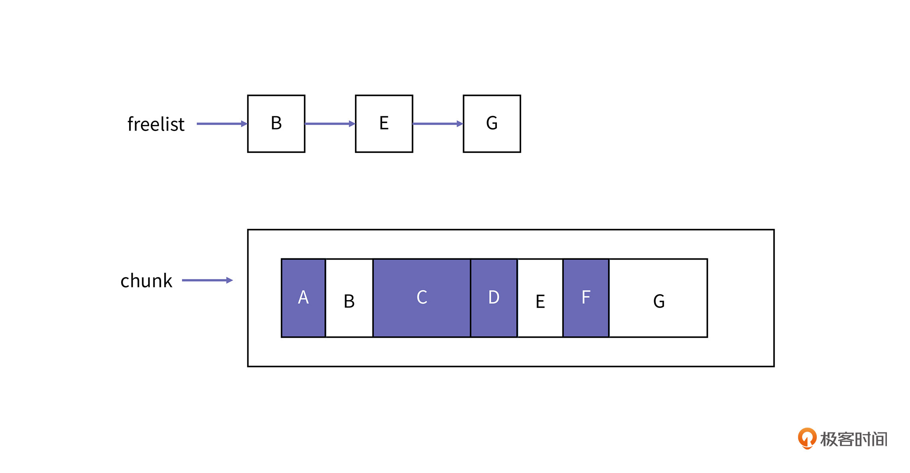
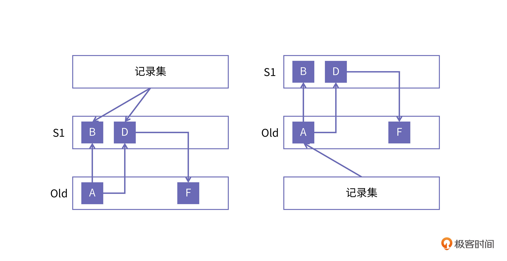
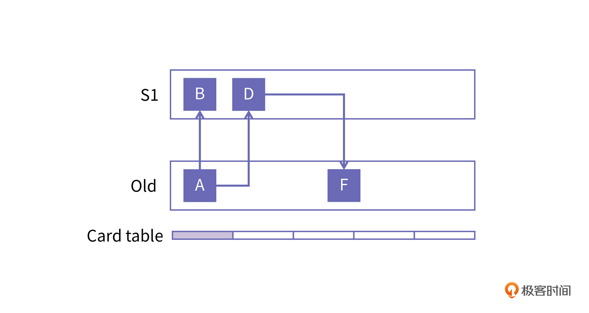
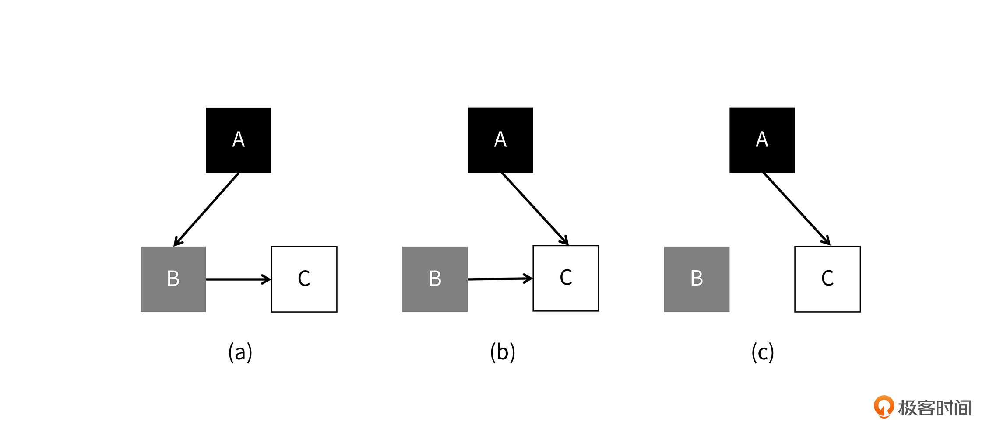
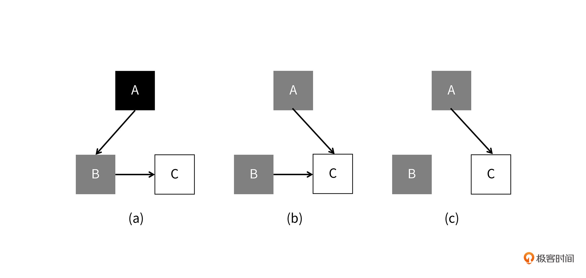
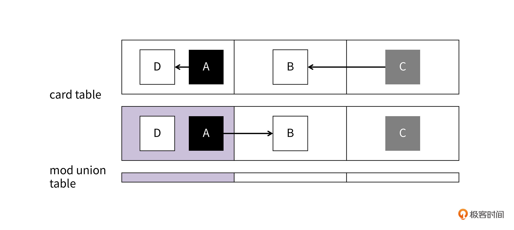
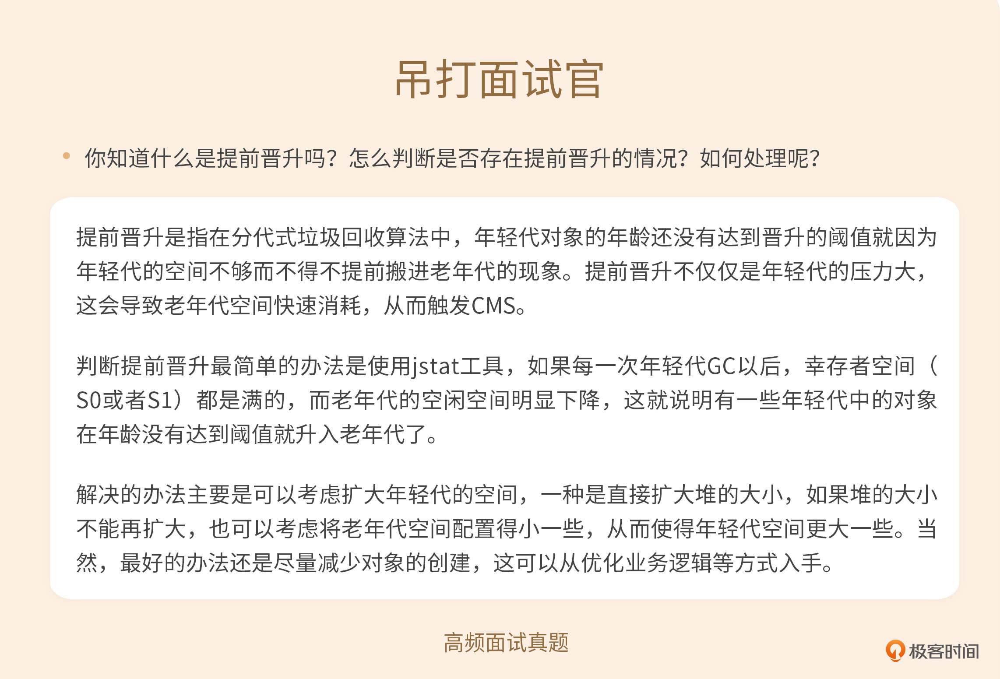

# 21 | 分代算法：基于生命周期的内存管理
<audio src='./21-分代算法：基于生命周期的内存管理.mp3' controls></audio>
你好，我是海纳。

上节课，我们讲过了可达性分析中基于copy的垃圾回收算法，它比较适合管理短生命周期对象。那什么算法适合管理长生命周期对象呢？它就是可达性分析的GC算法中的另一大类： **Mark-Sweep算法**。

为了发挥两种算法的优点，GC的开发者就基于对象的生命周期引入了分代垃圾回收算法，它将堆空间划分为年轻代和老年代。其中年轻代使用Copy GC来管理，老年代则使用Mark-Sweep来管理。

所以这节课我们将先介绍传统Mark-Sweep算法的特点，在此基础上再引入分代垃圾回收。年轻代算法的原理你可以去上节课看看，这节课我们就重点介绍老年代的管理算法，并通过Hotspot中的具体实现来进行举例。

通过这节课，你将从根本上把握住分代垃圾回收和老年代管理工作原理，在此基础上，你才能理解分代垃圾回收中比较晦涩的几个参数，从而可以对GC调优做到知其然且知其所以然。另外，CMS算法是你以后掌握G1 GC和Pauseless GC的基础，尽管CMS在现实场景中应用得越来越少，但它的基本原理却仍然是学习GC的重要步骤。

好啦，不啰嗦了，我们先从朴素的Mark-Sweep算法开始讲起。

## Mark-Sweep算法

简单来讲，Mark-Sweep算法由 **Mark和Sweep两个阶段组成**。在Mark阶段，垃圾回收器遍历活跃对象，将它们标记为存活。在Sweep阶段，回收器遍历整个堆，然后将未被标记的区域回收。

当传统的Mark-Sweep算法在分配新的对象时，它的做法与 [第9节课](https://time.geekbang.org/column/article/440452) 所讲的malloc分配算法是一样的，但在具体实现上还是有一些细微的差别。

Mark-Sweep算法和malloc相似的地方是，都是用一个链表将所有的空闲空间维护起来，这个链表就是 **空闲链表（freelist）**。当内存管理器需要申请内存空间时，便向这个链表查询，如果找到了合适大小的空闲块，就把空闲块分配出去，同时将它从空闲链表中移除。如果空闲块比较大，就把空闲块进行分割，一部分用于分配，剩余的部分重新加到空闲链表中。

Hotspot虚拟机的Mark-Sweep算法与malloc实现的不同之处在于：在Hotspot里，当一个空闲块分配给一个新对象后，如果剩余空间大于24字节，便将剩余的空间加入到空闲链表，当剩余空间不足24字节的话，就做为碎片空间填充一些无效值。而malloc则会分成多个空闲链表进行管理，更具体的实现可以参考 [第9节课](https://time.geekbang.org/column/article/440452)。

Hotspot中的Mark-Sweep的算法运行过程示意图如下：



图中的A、C、D、F是空间中的活跃对象，B、 E、G三块区域是空闲区域，假设B的大小是20，E是36，G是60。它们由空闲链表统一管理。

假设现在有两个分配请求，都要分配大小为30的空间，按照上面内容中的算法描述，具体的分配过程如下图所示：


E的大小为36，可以满足分配，但是E所剩下的区域已经比较小了，分配器不再将它加回到空闲链表，E和F之间就产生了一块内存碎片。第二个请求，则会在G区域进行分配，在分配完以后，G区域剩下的空闲区域还比较大，所以分配器会把分割后的空闲区域，也就是H区域再挂回空闲链表。上图中显示了分配完以后，堆里的最终结果。

介绍完空闲链表结构以后，我们来学习算法的原理。Mark-Sweep算法主要包含Mark和Sweep两个阶段。按照先后顺序，我们先从第一阶段，也就是Mark阶段开始讲起。

Mark阶段的核心任务是 **从根引用出发，根据引用关系进行遍历，所有可以遍历到的对象就是活跃对象**。我们需要一边遍历，一边将哪些对象是活跃的记录下来。当遍历完成以后，我们就找到了所有的活跃对象。遍历的方法可以采用深度优先和广度优先两种策略。这一点和上一节课所讲的对象遍历的方法是一样的。

那如何对活跃对象进行标记呢？一般来说，常见的方法有两种。 **一种是在每个对象前面增加一个机器字，采用其中的某一位作为“标记位”**。如果该位置位，就表示这个对象是活跃对象；如果该位未置位，那么表示这个对象是要回收的对象。

**另一种方法是采用标记位图，将每一个机器字映射成位图中的一个比特**。在真正的实现中，往往会采用两个位图，其中一个标记活跃对象的起始位置，另一个标记活跃对象的结束位置。

Sweep阶段要做的事情就是把非活跃对象，也就是垃圾对象的空间回收起来，重新将它们放回空闲链表中。具体做法就是按照空间顺序，从头至尾扫描整个空间里的所有对象，如果一个对象没有被标记，这个对象所占用内存就会被添加回空闲链表。这个阶段的操作是比较简单的，只涉及了链表的添加操作，而且它和malloc的回收过程是一致的，所以我就不再啰嗦了。

Mark-Sweep算法回收的是垃圾对象，如果垃圾对象比较少，回收阶段所做的事情就比较少。所以它适合于存活对象多，垃圾对象少的情况。而我们上节课讲的基于copy的垃圾回收算法Scavenge，搬移的是活跃对象，所以它更适合存活对象少，垃圾对象多的情况。既然如此，那我们能不能把这两种算法的优点结合起来，用不同的算法管理不同类型的对象呢？

## 分代垃圾回收算法

自然是可以的，对于存活时间比较短的对象，我们可以用Scavenge算法回收；对于存活时间比较长的对象，就可以使用Mark-Sweep算法。这就是分代垃圾回收算法产生的动机。

我们知道，Java中的函数局部对象和临时对象也会在堆里进行分配，这就导致Java中的对象的生命周期都不长。所以，使用Scavenge对这些对象进行管理是合适的。可以说， **Scavenge所管理的空间是“年轻代”**。

那怎么区分那些存活时间长的对象呢？我们可以在对象的头部记录一个名为age的变量，对象头部就是 [第19节课](https://time.geekbang.org/column/article/465516) 所介绍的Mark word。age变量不需要占据整个Mark word空间，只需要其中的几个比特就可以了。Scavenge GC每做一次，就是把存活的对象往Survivor空间中复制一次，我们就相应把这个对象的age加一，以此来代表它的生命周期比较长。

当对象的age值到达一个上限以后，就可以将它搬移到由Mark-Sweep算法所管理的空间了。与“年轻代”相对应，我们称这个空间为“老年代”。而对象从年轻代到老年代的搬移过程，就称为 **晋升(Promotion)。**

### 记录集：维护跨代引用

可以想象，把对象放到两个空间，肯定会有跨空间的对象引用。如下图所示：


上图中左边代表年轻代在GC之前，在幸存者空间S0中一共有6个对象，其中4个对象是活跃对象，两个白色框代表非活跃对象。假如此时发生年轻代GC，垃圾回收器就会把A、B、D、F四个对象尝试向另外一个幸存者空间，也就是S1进行搬移。

在搬移的过程还会将对象的age加一，如果刚好A对象和F对象的age大于晋升阈值，那么这两个对象就会被搬到老年代中。如上图中的右侧所示，在年轻代的幸存者空间中，对象都是紧密排列的，所以B和D会靠在一起。而在老年代空间，由于对象是从空闲区域中分配的，所以A和F不一定是靠在一起的。

显然，这就会带来一个问题，在以后年轻代GC执行时，我们就要考虑从老年代到年轻代的引用了，也就是图中，A指向B和D对象的引用。反过来说，当老年代GC执行时，也同样要考虑从年轻代到老年代的引用，也就是图中的D指向F的引用。

在进行年轻代垃圾回收时，为了找出从老年代到年轻代的引用，可以考虑对老年代对象进行遍历。但如果这么做的话，年轻代GC执行时，就会对全部对象进行遍历，分代就没意义了。

为了解决这个问题，我们可以想办法把这种跨代引用记录下来， **记录跨代引用的集合就是记录集（Remember Set，RS）。**

最直观的思路是，记录集里记录被引用到的新生代对象，如下图中的左侧所示：



记录集中记下了被跨代引用的B和D两个对象，那么当发生年轻代GC时，就能正确地找到B和D对象是根对象。但是这样做的问题是，当B和D再经过一轮年轻代GC，位置发生变化以后，A对象对它们的引用却无法正确维护。

为了解决这个问题，我们可以再进一步将A放到记录集中，也就是上图中右侧所示，记录集中指向了A对象。这样，在做年轻代GC时，我们对A进行遍历，就可以访问到B和D了。因为B和D在年轻代中，它们的位置会发生变化，变化的地址也能正确地更新到对象A中。A在老年代，所以它不会被搬移，我们只是借用它去访问B和D。

搞清楚了记录集的作用，我来接着看如何维护记录集呢？

### 写屏障：维护记录集

维护记录集的手段，在 [第19节课](https://time.geekbang.org/column/article/465516) 我们已经接触过了，那就是写屏障（write barrier）。在 [第19节课](https://time.geekbang.org/column/article/465516)，我们在对象的引用发生变化的时候，来维护对象的引用计数。在分代式垃圾回收算法中，我们可以使用同样的思路来维护跨代引用。

当对象的属性进行写操作时，跨代引用就有可能出现。所以，我们在这个时候可以检查是否存在跨代引用。写屏障的伪代码如下所示：

```
void do_oop_store(Value obj, Value* field, Value value) {
    if (in_young_space(value) && in_old_space(obj) &&
        !rs.contains(obj)) {
      rs.add(obj);
    }
    *field = &value;
}

```

上面代码中，obj代表引用者对象；value代表被引用的对象；field代表obj对象中被修改的那个域，它是一个指针，代表了地址，这意味着我们要修改地址处存放的值，而不是修改指针本身。

在进行对象的域赋值时，我们要先做以下三个判断（第2行）：

1. **被引用的对象是否在年轻代**；
2. **发出引用的对象，也就是引用者，是否在老年代；以上两点都满足，就说明产生了跨代引用**；
3. **检查记录集中是否已经包含了obj**。

如果以上三点都满足，就将obj添加到记录集中（第4行）。

**还有一种情况可能产生跨代引用，那就是晋升**。假设A对象引用B对象，它们都在年轻代里，经过一次年轻代GC，A对象晋升到老年代，那这也会产生跨代引用，所以在晋升的时候，我们也要对这种情况加以处理。晋升的完整伪代码，如下所示：

```
void promote(obj) {
  new_obj = allocate_and_copy_in_old(obj);
  obj.forwarding = new_obj;

  for (oop in oop_map(new_obj)) {
    if (in_young_space(oop)) {
      rs.add(new_obj);
      return;
    }
  }
}

```

在上面的代码里，我们先在老年代中分配一块空间，把待晋升对象复制到老年代。然后把新地址new\_obj记录到原来对象的forwarding指针。接着遍历从这个对象出发的所有引用，如果这个对象有引用年轻代对象，就把这个晋升后的对象添加到记录集中。

在上面所讲的写屏障实现里，一个对象写操作中要进行三个判断，如果条件成立，还要再执行一次记录集的添加对象操作，效率是比较差的。为了提升效率，又有人提出了 **Card table这种实现方式来提升写屏障的效率**。

### Card table：提升写屏障效率

随着对象的增多，记录集会变得很大，而且每次对老年代做GC，正确地维护记录集也是一件复杂的事情。另外，写屏障的效率也不高，为了解决这个问题，可以借鉴位图的思路，这就是Card table。

Hotspot的分代垃圾回收将老年代空间的512bytes映射为一个byte，当该byte置位，则代表这512bytes的堆空间中包含指向年轻代的引用；如果未置位，就代表不包含。这个byte其实就和位图中标记位的概念很相似，人们称它为card。多个card组成的表就是Card table。一个card对应512字节，压缩比达到五百分之一，Card table的空间消耗还是可以接受的。



如上图所示，图的下方就是Card table，因为A对象包含指向年轻代的引用，所以A对象所对应的card就被置位，而F对象不存在指向年轻代的引用，所以它所对应的card就未被置位。

在明白了分代式垃圾回收是如何维护跨代引用的以后，我们就可以转向研究Hotspot中分代式垃圾回收的典型算法： **并发标记清除算法（Concurrent Mark Sweep，CMS）**。标记清除的概念我们已经介绍过了，并发又是什么意思呢？接下来，我们一起来研究一下。

## 并发标记算法

在并发标记算法中，当垃圾回收器在标记活跃对象的时候，我们肯定不希望业务线程同时还会修改对象之间的引用关系。所以，早期的Mark-Sweep算法会让业务线程都停下来，以便于垃圾回收器可以对活跃对象进行标记，这就是GC停顿产生的原因。由于业务线程停顿的时候，整个Java进程都不能再响应请求， **人们把这种情况形象地称为“世界停止”（Stop The World，STW）**。

为了减少GC停顿，我们可以在做GC Mark的时候，让业务线程不要停下来。这意味着GC Mark和业务线程在同时工作，这就是 **并发**（Concurrent）的GC算法。

这里你要注意区别并发（Concurrent）和并行（Parallel）的区别。并发GC是指GC线程和业务线程同时工作，并行是指多个GC线程同时工作。

Hotspot中在实现Mark-Sweep算法的时候，采用了并发的方式，这就是并发标记清除，简称为CMS。它的特点是GC线程在标记存活对象的过程中，业务线程是不必停下来的。直觉上就是一边对图进行遍历，一边修改图中的边，这样肯定会产生问题。接下来，我们就详细地分析一下这么做到底会有什么问题。

为了方便描述，我们引入三种颜色来辅助算法的讲解。我们知道，图的遍历过程，就是不断地对结点进行搜索和扩展的过程。以标记算法来说，如果采用广度优先遍历，那么搜索就是对结点进行标记，扩展就是将结点所引用的其他对象都添加到辅助队列中。根据这个定义，我们可以将结点分为三类：

- **白色：还未搜索的对象；**
- **灰色：已经搜索，但尚未扩展的对象；**
- **黑色：已经搜索，也完成扩展的对象。**

这里要注意，三色标记并不意味着对象真的要为自己增加一个color属性，它只是一种抽象的概念，在不同的GC算法中，它代表不同的状态。

我们以广度优先搜索的标记算法为例，白色对象就是未被标记的对象；灰色则是已经被标记，但还没有完成扩展的对象，也就是还在队列中的对象；黑色则是已经扩展完的对象，即从队列中出队的对象。

你要注意的是，并发标记中最严重的问题就是 **漏标**。如果一个对象是活跃对象，但它没有被标记，这就是漏标。这就会出现活跃对象被回收的情况。例如下图中所示：



在上图中的最左边，标号（a）的子图中，一切都还是正常的，B尚未扩展，在B扩展的时候，C自然可以被标记。在（b）中，A出发的引用指向了C，这时由于B指向C的引用还存在，仍然没有什么问题。但在（c）中，B指向C的引用消失了，因为A已经变成黑色，不会再被扩展了，所以C就没有机会再被标记了。这就产生了漏标。

总的来说，黑色对象引用了白色对象，而白色对象又没有其他机会再被访问到，所以白色对象就被漏标了。

漏标问题的解决方案主要有三种，我们这节课会介绍两种，第三种我们会在下一节课再详细介绍。第一种解决方案是 **往前进** 的方案，如下图所示：


解决漏标问题，还是要从写屏障入手。荷兰计算机科学家Dijkstra提出一种写屏障： **当黑色对象引用白色对象时，把白色对象直接标灰，也就是说将C对象直接标记，然后放入队列中待扩展**。这个过程的伪代码我建议你自己写一下，作为练习。

往前走的方案是比较符合直觉的，但是假如在C对象被标记以后，A对C的引用又消失了，C实际上是被多标了。多标并不会带来严重的后果，它只会导致原本应该被回收的对象没有被及时回收，这种对象被称为 **浮动垃圾**。

为了解决浮动垃圾这个问题，我们可以使用第二种方案，那就是 **往后退一步**：把黑色对象重新扩展一次，也就是说黑色结点变成灰色。如下图所示：



如果对象修改比较频繁，那么后退一步的方案会比前进一步的方案更好，因为它不会产生浮动垃圾。Lua虚拟机中就采用了方案二，这是因为Lua中的Table结构的修改是比较频繁的。

在Hotspot中，CMS的实现和上面的两种思路有关系，但又不完全一样，接下来，我们全面地分析一下在Hotspot中，CMS是如何实现的。

## Hotspot中CMS的实现

在Hotspot中，CMS是由多个阶段组成的，主要包括初始标记、并发标记、重标记、并发清除，以及最终清理等。其中：

- **初始标记阶段**，标记老年代中的根对象，因为根对象中包含从栈上出发的引用等比较敏感的数据，并发控制难以实现，所以这一阶段一般都采用Stop The World的做法。这里一般不遍历年轻代对象，也就是不关注从年轻代指向老年代的引用。
- **并发标记阶段**，这一阶段就是在上面内容中讲到的三色标记算法中做了一些改动，我们会在后面的内容中详细分析这一阶段的实现。
- **重标记阶段**，这一阶段会把年轻代对象也进行一次遍历，找出年轻代对老年代的引用，并且为并发标记阶段扫尾。
- **并发清除阶段**，这一阶段会把垃圾对象归还给freelist，只要注意好freelist的并发访问，实现垃圾回收线程和业务线程并发执行是简单的。
- **最终清理阶段**，清理垃圾回收所使用的资源。为下一次GC执行做准备。

CMS中最复杂的还是并发标记阶段。如果在并发标记的过程中，业务线程修改了对象之间的引用关系，CMS采用的办法是： **在write barrier中，只要一个对象A引用了另外一个对象B，不管A和B是什么颜色的，都将A所对应的card置位。**

由于不必检查颜色，这个置位的过程就非常快，你可以自己思考一下，card置位的具体实现。当一轮标记完成以后，如果还有置位的card，那么垃圾回收器就会开启新一轮并发标记。新的一轮标记，会从上一轮置位的card所对应的对象开始进行遍历，遍历完成后再把card全部清零，所以这样的一轮并发标记也被称为 **预清理（preclean）**。

如果恰好在某一轮并发标记的过程中，业务线程不再修改对象之间的引用关系了，那么就不会再产生card置位的情况了。这时就可以结束并发标记阶段了。

但是如果每一轮都有card置位，应该怎么办呢？CMS也会在预清理达到一定次数以后停止，进入重标记阶段。重标记的作用是遍历新生代和card置位的对象，对老年代对象做一次重新标记。这一次是需要停顿的，因为这一次垃圾回收器将不允许card再被置位了。

一般来说，新生代指向老年代的引用不会太多，但是偶尔也会发生这种引用很多的情况，如果出现了这种情况，可以在重标记之前，进行一次年轻代GC，这样可以减少年轻代中的对象数量，减少重标记的停顿时间。这个功能可以使用参数-XX:+CMSScavengeBeforeReMark来打开。

这个过程的示意图如下所示：



因为card table有两个功能：维护跨代引用和标记灰色结点，所以，Hotspot又引入了另外一个数据结构mod union table（MUT）来用于维护跨代引用。在并发标记开始之前，card table中的内容就会被复制到MUT里，如果在Concurrent Mark阶段，发生了年轻代的垃圾回收，则可以使用MUT来进行跨代扫描。

上图中展示了，A对象在引用B对象时，A对象所对应的card被置位。因为D对象所对应的card和A对象所对应的card是同一个card，所以，GC在清理card的过程中仍然会把D对象进行标记。所以D就是一个被多标记了的垃圾对象，也就是浮动垃圾。

到这时，Hotspot中的具体实现我们就搞清楚了。

## 总结

好啦，这节课到这里就结束啦，我们一起来回顾一下这节课的重点内容吧。这节课，我们先介绍了最基本的 **Mark-Sweep算法**，它使用空闲链表来组织空闲空间，它的分配过程与 [第9节课](https://time.geekbang.org/column/article/440452) 介绍的malloc的方法很相似。在标记阶段，垃圾回收器通过图遍历算法来标记对象，在活跃对象被标记以后，不活跃的区域会被集中地归还到空闲链表中。

**Mark-Sweep算法最大的特点是不移动活跃对象，只回收不活跃的空间**。所以它更适合管理生命周期比较长的对象。它的特点与上节课所讲的基于copy的算法刚好互补，所以人们就把这两者结合起来，使用copy算法管理短生命周期对象，也就是 **年轻代**；使用Mark-Sweep算法管理长生命周期对象，也就是 **老年代**。

在分代式垃圾回收算法里，最大的挑战是如何维护跨代引用，以加速单独的某个代的垃圾回收的过程。我们介绍了 **记录集** 和 **Card table** 两种方式，并且介绍了如何使用write barrier对它们进行维护。

在分代垃圾回收算法里， **用于管理老年代的是CMS算法**。这种算法的主要挑战来自于垃圾回收线程在标记的过程中，业务线程还在不断地修改对象之间的引用关系。我们介绍了三色标记算法，并且介绍了两种解决漏标问题的手段： **“往前走”和“往后退一步”**。

## 思考题

我们已经知道标记的过程就是图遍历的过程，那你觉得在Mark-Sweep算法中，应该采用广度优先还是深度优先进行遍历呢？为什么呢？考虑到对象不必搬移，你还能不能想到更省空间的做法？欢迎在留言区分享你的想法，我在留言区等你。



好啦，这节课到这就结束啦。欢迎你把这节课分享给更多对计算机内存感兴趣的朋友。我是海纳，我们下节课再见！